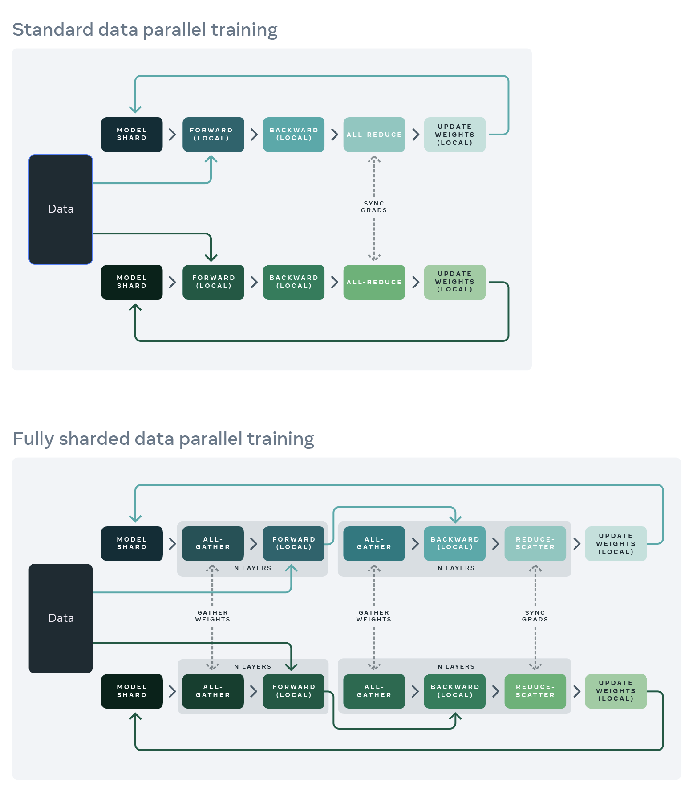

# \[2019 SC] ZeRO: memory optimizations toward training trillion parameter models

## Summary

ZeRO is a new distributed training paradigm that vastly improves the memory efficiency of large-scale model training.

## Background & Motivation

Existing solutions for distributed training include data parallelism (DP), model parallelism (MP), pipeline parallelism (PP), 3D parallelism, CPU offloading, etc., each with a couple of catches:

* DP has good compute/communication efficiency but poor memory efficiency. In DP, each parallel worker holds a full copy of the model, so each device quickly runs out of memory (e.g., for models with > 1.4B parameters on a GPU with 32 GB GRAM).
* MP has good memory efficiency but poor compute/communication efficiency. It splits the model vertically, requiring significant communications between each layer on different devices. As a result of that, the efficiency quickly degrades when devices become far apart from each other: for example, when training a 40B-parameter model across two DGX nodes, each GPU's computing efficiency (tflops) is only 5% of the hardware peak.
* Different implementations of PP have different issues. For example, [G-pipe](gpipe-efficient-training-of-giant-neural-networks-using-pipeline-parallelism.md) requires a batch size proportional to the number of pipeline partitions, and a large batch size might hurt convergence. [PipeDream](pipedream-generalized-pipeline-parallelism-for-dnn-training.md) is very memory inefficient due to weight stashing.

Is there a way to achieve the best of all worlds? The Microsoft folks first take a look at the spectrum of memory consumption in large-model training, and they classify the memory consumption into two parts:

1. Model states: parameters, gradients, and optimizer states (e.g., momentum and variances in Adam). These take the majority of the memory in large-model training.
2. Residual states: activations, temporary buffers, and unusable fragmented memory.

The authors develop ZeRO-DP to address (1) and ZeRO-R to address (2).

## Design & Implementation

A key insight of ZeRO-DP is that both DP and MP keep all the model states needed over the entire training process, but not everything is required all the time. For example, parameters corresponding to each layer are only needed during the forward/backward propagation of the layer.

### ZeRO-DP Stage 1: Optimizer State Partitioning

The optimizer states are grouped into N equal partitions (N is the DP degree), such that worker i only stores and updates the optimizer states of partition i (1/N of the total optimizer states and parameters).

### ZeRO-DP Stage 2: Gradient Partitioning

As each DP process only updates its corresponding parameter partition, it only needs the reduced gradients for the corresponding parameters. Therefore, as each gradient of each layer becomes available during the backward propagation, we only reduce them on the DP process responsible for updating the corresponding parameters. After the reduction, we no longer need the gradients and their memory can be released. The total communication volume is the same as vanilla DP (all-reduce = reduce-scatter + all-gather), because in this setup, a reduce-scatter is performed on the gradients and an all-gather on the parameters.

### ZeRO-DP Stage 3: Parameter Partitioning

In this stage, each process only stores the parameters corresponding to its partition. When the parameters outside of its partition are required for forward/backward propagation, they are received from the appropriate DP process through broadcast. This technique only increases the total communication volume to 1.5x of a DP baseline (two all-gathers of the parameters are required for forward/back prop, and the gradients need to be reduce-scattered), while reducing the per-worker memory consumption by N times. With all these optimizations, trillion-parameter models can be trained on thousands of modern-day GPUs.

### ZeRO-R

A lot of follow-up works of ZeRO focuses on ZeRO-DP, so I'll come back to read this section later

## Evaluation

## ZeRO-Infinity and ZeRO-Offload

ZeRO-Infinity and ZeRO-Offload are follow-up systems that offload data and compute to CPUs and NVMe.

## Links & References

* [Paper PDF](https://arxiv.org/pdf/1910.02054.pdf)
* [Presentation video at a webinar](https://www.youtube.com/watch?v=zqsOEzKZX2Y)
* Blog: [ZeRO & DeepSpeed: New system optimizations enable training models with over 100 billion parameters](https://www.microsoft.com/en-us/research/blog/zero-deepspeed-new-system-optimizations-enable-training-models-with-over-100-billion-parameters/). This includes a nice video that explains how ZeRO-DP works.
* [DeepSpeed on GitHub](https://github.com/microsoft/DeepSpeed)
