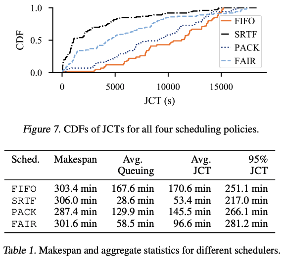

# \[2020 MLSys] Salus: Fine-Grained GPU Sharing Primitives for Deep Learning Applications

## One-line Summary

Salus presents two GPU sharing primitives for fine-grained GPU sharing among multiple DL applications: fast job switching (for time-sharing and preemption) and GPU lane abstraction (for dynamic memory sharing). Together, these primitives improve all aspects of training performance and open the gate to implementing novel policies.

## Paper Structure Outline

1. Introduction
2. Background and Motivation
   1. DL Workloads Characteristics
   2. Existing Techniques for Sharing GPUs
3. Salus
   1. Architectural Overview
   2. Efficient Job Switching
      1. Characterizing DL Memory Allocations
      2. Scheduling Granularity
   3. Spatial Sharing via GPU Lane
      1. Lane Auto Defragmentation
      2. Lane Assignment
4. Scheduling Policies in Salus
   1. PACK to Maximize Efficiency
   2. SRTF to Enable Prioritization
   3. FAIR to Equalize Job Progress
5. Evaluation
   1. Long-Running Training
      1. Overall Comparison
      2. Impact of Fast Job Switching
   2. Hyper-Parameter Exploration
   3. Inference
   4. Overhead
6. Concluding Remarks

## Background & Motivation

The modern GPU allocation model (coarse-grained, one-at-a-time) is not good enough, in that it creates a high overhead for flexible scheduling (time-sharing, preemption, migration). Also, as having multiple coexisting processes in a GPU is not efficient, the GPU becomes underutilized.

## Design and Implementation

Existing GPU sharing techniques are not efficient. Salus tackles this by exposing two GPU sharing primitives: fast job switching and memory sharing.&#x20;

### Fast Job Switching

Modern frameworks use checkpointing for job switching to achieve second-scale suspend-resume. Nevertheless, checkpointing results in large data transfer from/to the GPU memory, making the communication cost non-negligible. In Salus, memory allocations are classified into three types:

1. Model: Model parameters, persistent, no temporal variations.
2. Ephemeral: Intermediate layer's outputs/temporal data generated by the algorithm itself. Only needed during computations and are released between iterations.
3. Framework-internal: Used by the DL framework for book-keeping/data preparation pipeline. Persistent across iterations.

As persistent memory is significantly less than ephemeral memory, more than one job's persistent memory can be kept in GPU while still having space for either job's ephemeral memory. Thus, fast job switching is enabled by not removing persistent memory from GPU at all.

### Spatial Sharing via GPU Lane

In Salus, the GPU memory space is divided into ephemeral and persistent regions, and the ephemeral region is furthur divided into lanes, which are continuous memory spaces that can contain ephemeral memory allocation for iterations. This allows time-slicing within lanes and parallelism across lanes. Salus also supports automatic in-lane defragmentation and dynamic lane assignment (re-partitioning).

### Scheduling Policies

1. PACK (Maximize Efficiency): Multiple jobs can be packed in separated GPU lanes to achieve higher utilization and minimize makespan. This allows training many jobs in parallel and enables efficient inference serving.
2. SRTF (Enable Prioritization): Salus supports job priorities by doing preemption of larger jobs.
3. FAIR (Equalize Job Progress): This equalizes total service over time for jobs in each lane.
4. FIFO: The de facto mechanism nowadays.

## Evaluation

## New Vocabulary

*

## Links

* [Paper PDF](https://www.mosharaf.com/wp-content/uploads/salus-mlsys20.pdf)
* [Presentation slides at MLSys '20](https://mlsys.org/media/Slides/mlsys/2020/balla\(03-10-30\)-03-10-30-1426-fine-grained\_gp.pdf)
* [Poster](https://unlimitedcodeworks.xyz/assets/pub/yu20mlsys/yu20mlsys-poster.pdf)
* [Salus on GitHub](https://github.com/SymbioticLab/Salus)
