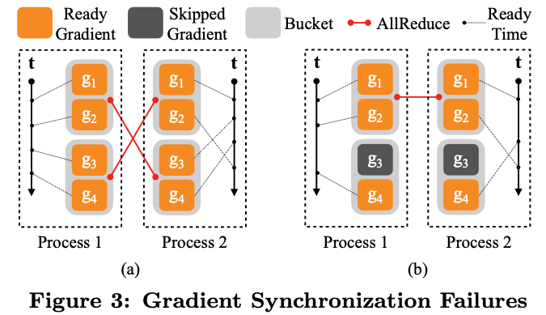
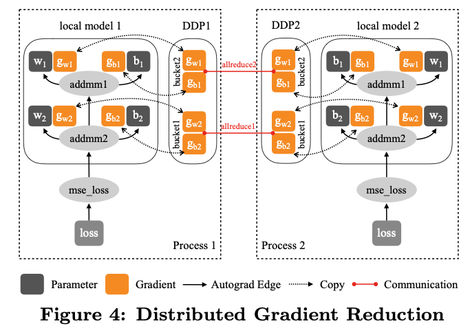
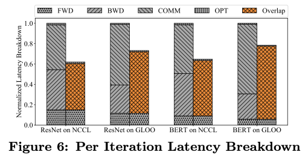
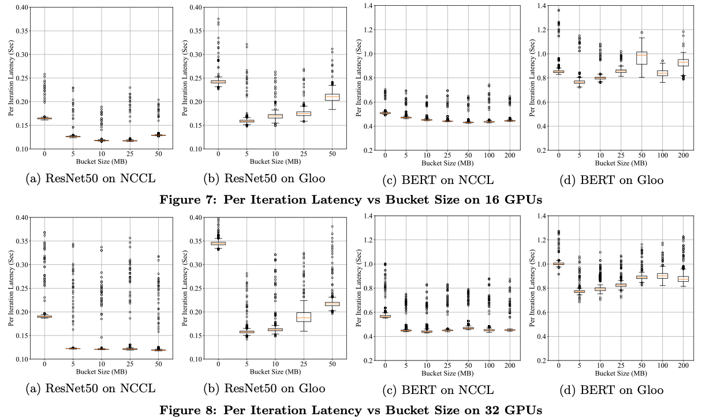
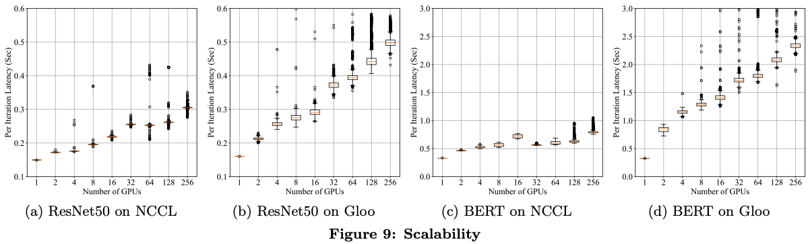
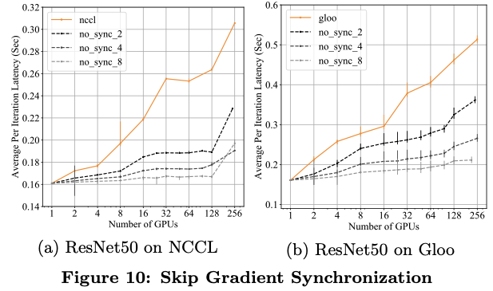
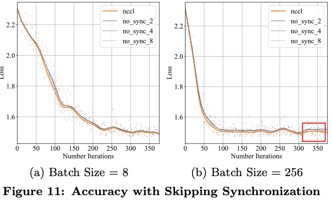
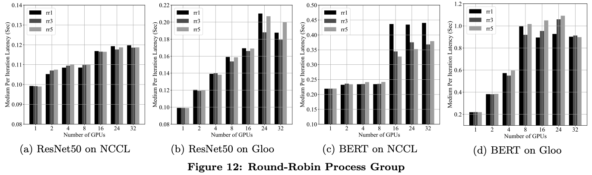

# PyTorch Distributed: Experiences on Accelerating Data Parallel Training

## One-line Summary

This paper presents the design, implementation, and evaluation of the PyTorch distributed data parallel module.

## Paper Structure Outline

1. INTRODUCTION
2. BACKGROUND
   1. PyTorch
   2. Data Parallelism
   3. AllReduce
3. SYSTEM DESIGN
   1. API
   2. Gradient Reduction
      1. A Naive Solution
      2. Gradient Bucketing
      3. Overlap Computation with Communication
      4. Gradient Accumulation
   3. Collective Communication
4. IMPLEMENTATION
   1. Python Front-end
   2. Core Gradient Reduction
5. EVALUATION
   1. Latency Breakdown
   2. Bucket Size
   3. Scalability
   4. Round-Robin Process Group
6. DISCUSSION
   1. Lessons Learned
   2. Future Improvements
      1. Gradient Order Prediction
      2. Layer Dropping
      3. Gradient Compression
7. RELATED WORK
8. CONCLUSION

## Background & Motivation

There are three steps in training a DNN model:

1. Forward pass: Computes loss
2. Backward pass: Computes gradients
3. Optimizer step: Updates parameters

To train large models on large datasets, data parallelism is applied so that multiple workers work together to do the training. Each worker holds a replica of a model, trains the model \(forward & backward pass\) using a partition of the dataset, and averages the gradients/parameters among the workers.

## System Design

### API

There are two design goals when designing the API:

1. Non-instrusive: Converting local training scripts to distributed scripts should require minimal code modifications.
2. Interceptive: For as many optimizations as possible to work, the API needs to allow the implementation to intercept various signals and trigger appropriate algorithms correctly.

### Gradient Reduction

1. **Naive solution**: DDP controls all training processes to \(1\) start from the same model state and \(2\) consume the same gradients in every iteration. \(2\) can be implemented by inserting a gradient synchronization phase after the local backward pass, or by adding a hook to trigger computation after every backward pass. There are two performance concerns:
   1. Collective communication performs poorly on small tensors
   2. By separating the gradient computation and synchronization, we lose the chance to overlap the two phases
2. **Gradient bucketing**: We can observe that collective communications are more effective on large tensors than on smaller tensors. As a result, we can use gradient reduction to bucket multiple gradients into one allreduce operation. However, DDP should not compact all gradients in one single allreduce, otherwise the communication cannot overlap with computation.
3. **Overlap computation with communication**: With bucketing, DDP only needs to wait until all contents in the same bucket is ready before launching communications. There are two things that requires attention, though. The first thing is that the reducing order must be the same across all processes, otherwise mismatches might occur. The other thing is that the backward pass could hang due to some gradients being skipped and never saying "I'm ready" to their corresponding buckets. See the graph below for two examples.
4. **Gradient accumulation**: Instead of doing allreduce for every iteration, do allreduce every n interations.

The paper covered some level of technical details for each of the above four subsections.

### Collective Communication

DDP is built on top of communication libraries like NCCL, Gloo, and MPI. The APIs from all three libraries are wrapped into the same ProcessGroup API. In DDP, workers are expected to join a process group for commuication primitives to work on.

### Implementation Details

1. Python Front-end
   1. Configurable knobs
   2. Model device affinity
   3. Model buffers
2. Core Gradient Reduction
   1. Parameter-to-bucket mapping
   2. Autograd hook
   3. Bucket allreduce
   4. Globally unused parameters

## Evaluation

## Discussion

There is no single configuration that would work for all use cases, but there are some rules that can be summarized and can help us narrow down the range of the optimal configuration:

1. **Communication backend**: In most cases, NCCL is considerablly faster than Gloo.
2. **Bucket size**: The optimal bucket size lies in between the small extreme and the large extreme. The optimal bucket sizes are likely to increase with the size of the model in a sub-linear manner.
3. **Resource allocation**: In NCCL, it is recommended to keep the workers in a DDP group within the same machine, otherwise there will be significant slowdown due to the bandwidth across the machines being lower than that between same-machine GPUs.

Some future directions for optimizations:

1. **Gradient order prediction**: trace the backward order using autograd hooks and update parameter to bucket mapping accordingly
2. **Layer dropping**: drop layers randomly during the forward pass
3. **Gradient compression**: only communicates gradients with the necessary precision

## New Vocabulary

* Hooks in PyTorch: A hook can be registered on a Tensor or a nn.Module. A hook is basically a function that is executed when either forward or backward is called.
* [Computation graph in PyTorch](https://jdhao.github.io/2017/11/12/pytorch-computation-graph/)

## Links

* [Paper PDF](https://arxiv.org/pdf/2006.15704.pdf)
* [CS 744 Slides & Notes](http://pages.cs.wisc.edu/~shivaram/cs744-fa20-slides/cs744-pytorch-notes.pdf)
* [Debugging and Visualization in PyTorch using Hooks](https://blog.paperspace.com/pytorch-hooks-gradient-clipping-debugging/)

