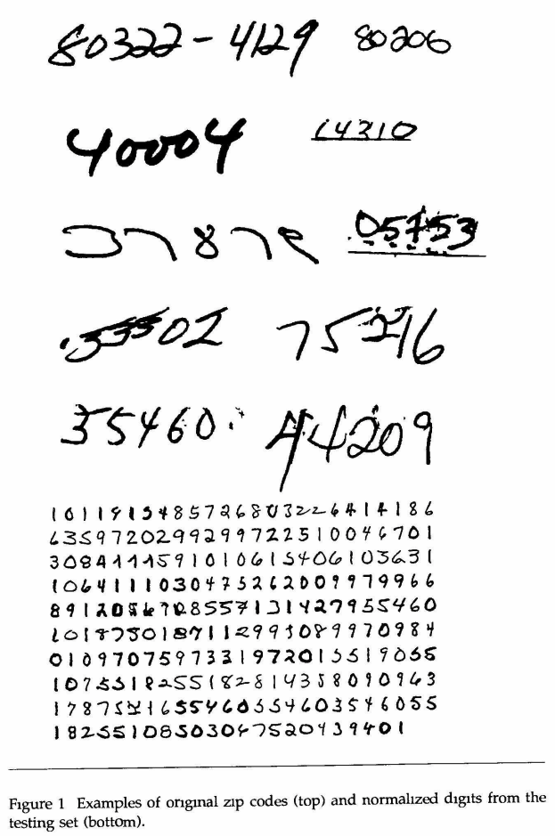
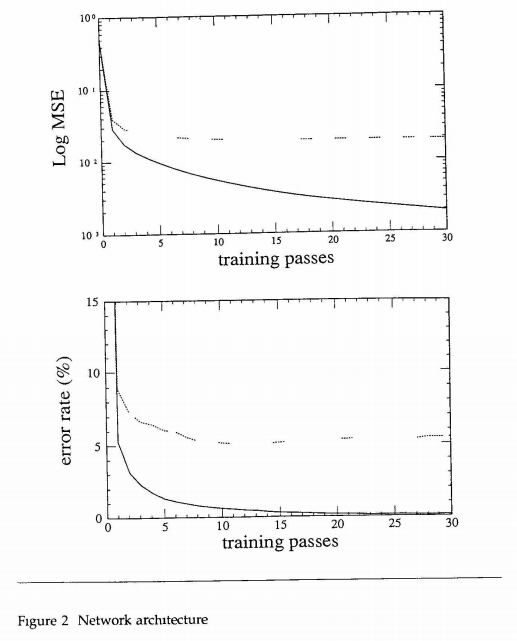

# Backpropagation Applied to Handwritten Zip Code Recognition

## One-line Summary

This work applies backpropagation learning to a large, real-world task: Handwritten digit recognition. The final throughput is ~10 images per second. This is a phenomenal work that precedes many neural network architectures and the MNIST dataset \[99'\] itself.

## Paper Structure Outline

1. Introduction
2. Zip Codes
   1. Data Base
   2. Preprocessing
3. Network Design
   1. Input and Output
   2. Feature Maps and Weight Sharing
   3. Network Architecture
4. Experimental Environment
5. Results
   1. Comparison with Other Work
   2. DSP Implementation
6. Conclusion

## Background & Motivation

## Design and Implementation

## Evaluation

## Links

* [Paper PDF](http://yann.lecun.com/exdb/publis/pdf/lecun-89e.pdf)

