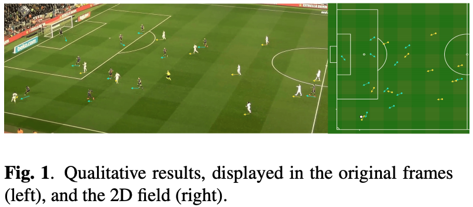
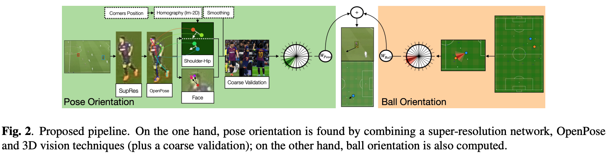
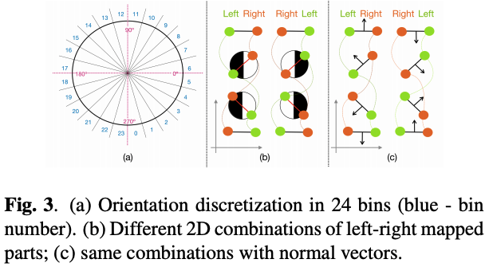
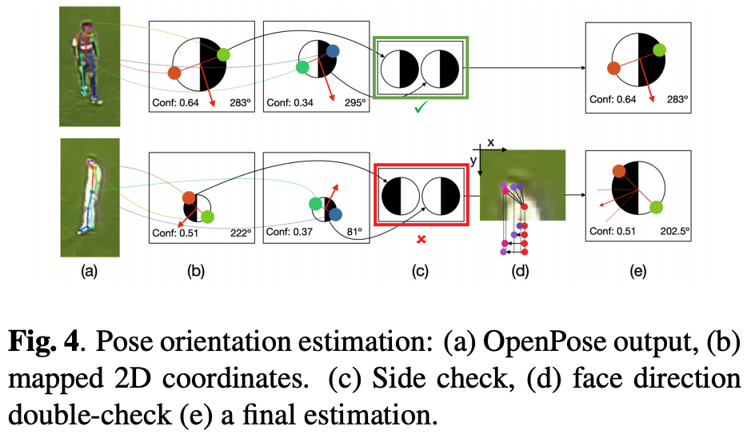
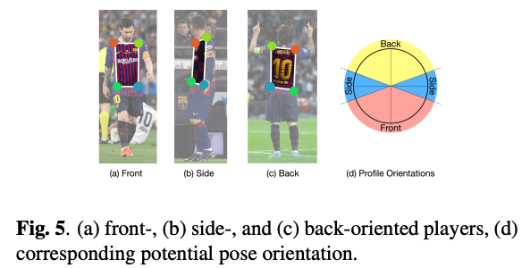
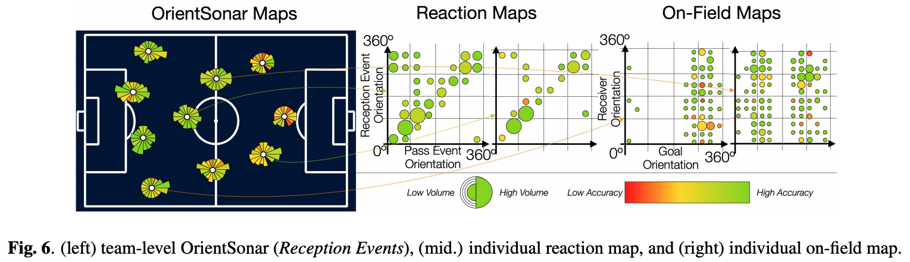

# Merging Pose And Contextual Data To Estimate Orientation Of Soccer Players

## One-line Summary

This work provides a framework to map the 3D direction of players into 2D projections from video recordings.

## Paper Structure Outline

1. Introduction
2. Proposed Method
   1. Pose Orientation
   2. Ball Orientation
   3. Contextual Merging
3. Results
4. Practical Applications
5. Conclusions

## Background & Motivation

* In sports analytics, body orientation is important yet under-studied
* OpenPose is a framework that detects human {body,face,hands,foot} keypoints on single images
* A residual dense network for image super-resolution was presented at CVPR '18. This addresses the issue of motion blurs in input videos and thus makes them available for processing through OpenPose.

## Design and Implementation

The model provides orientation estimation on \(1\) pose data and \(2\) ball position.

## Evaluation

* OpenPose detects upper-torso parts in 89.69% of the given image crops
* Coarse orientation validation obtains 85.91% accuracy
* LR-side performance reaches 96.57% accuracy

OrientSonars integrate player orientation and show how players are oriented during pass events. In this display, the following size-color codification is adopted: the radius length of each portion in the map quantifies the volume of passes at a particular orientation, while the color displays their associated accuracy. Reaction Maps show how players are moving during the pass, by comparing the orientation at the beginning and at the end of the event; once again, the dot area expresses the volume. If a player keeps his/her orientation, the resulting map will just have dots in a diagonal line; otherwise, off-diagonal dots appear in the graph. OnField Maps merge and compare the pure body orientation of players with their relative orientation with respect to the offensive goal. All these maps can be extracted at a player- or team-level, and custom filters can be created in order to introduce context such as game phases \(build-up, progression, and finalization\); moreover, accuracy might not be the best metric to be used, so maps can be color-codified according to other techniques like [Expected Possession Value](../drafts/decomposing-the-immeasurable-sport-a-deep-learning-expected-possession-value-framework-for-soccer.md).

## New Vocabulary

* [EPTS: Electronic Performance & Tracking Systems](https://www.youtube.com/watch?v=Jmn5dfZX1u4&feature=emb_title&ab_channel=FIFATV)

## Links

* [Paper PDF](https://arxiv.org/pdf/2003.00943.pdf)
* [OpenPose: Realtime Multi-Person 2D Pose Estimation using Part Affinity Fields](https://arxiv.org/abs/1812.08008)
* [Residual Dense Network for Image Super-Resolution](https://arxiv.org/pdf/1802.08797.pdf)

