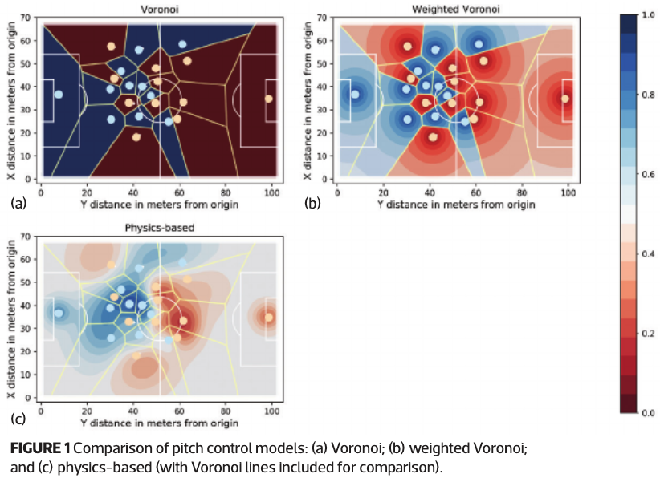

# Soccer analytics: Unravelling the complexity of “the beautiful game”

## One-line Summary

This is more of a meta-paper that introduces the field of soccer analytics and looks at some case studies for applications.

## Paper Structure Outline

1. Introduction
2. Where are they now?
3. Pitch control models
4. A Physics-based model of pitch control
5. Measuring spatial value
6. Pressing forward

## Background & Motivation

In soccer, on-ball actions provide not that much insight into strategy and player evaluation as each player only has the ball three minutes on average in a standard 90-minute game. Technology is growing, and nowadays people are able to track game-level events, on-ball events, and off-ball movements and allow for data-informed decision making. As more data becomes available, the statistics community is leaning in and developing metrics that leverage the data to measure the game in ways more closely aligned with winning strategies.

## The Voronoi Model for Pitch Space Partitioning and A Physics-Based Model of Pitch Control

Every on-pitch location is assigned to the closest player in the classical Voronoi model. A variant, the weighted Voronoi model, uses a weighting function to account for the relative level of influence a player i has over location m. Finally, some typical physics-based models are presented which gives probabilistic outputs of the probability that a given player controls the ball if it is passed to a given location. As seen in Fig. 1-c, the physics-based pitch control model gives a smooth surface of control, allowing for increased control when multiple teammates are clustered together, instead of the sharp edges in the previous two models.

## Spatial Value

Here we can observe that the defender positioning changes drastically as a function of the ball's location. A feed-forward neural network with one hidden layer is used in [this work](../drafts/wide-open-spaces-a-statistical-technique-for-measuring-space-creation-in-professional-soccer.md) to get a model-based estimate for defensive team control as a function of ball location.

## Links

* [Paper PDF](https://rss.onlinelibrary.wiley.com/doi/epdf/10.1111/j.1740-9713.2018.01146.x)

