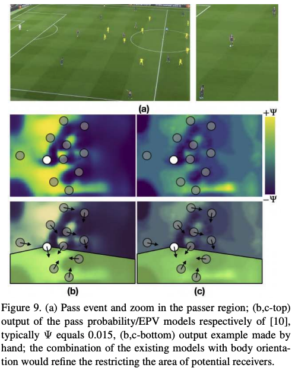

# Using Player’s Body-Orientation to Model Pass Feasibility in Soccer

## One-line Summary

In this work, a model that estimates the feasibility of passes in soccer games using the body orientation of players is presented.

## Paper Structure Outline

1. Introduction
2. Related work
3. Proposed Pass-Orientation Model
   1. Orientation
   2. Defenders Position
   3. Pairwise Distances
   4. Combination
4. Results
   1. Orientation Relevance in Pass Feasibility
   2. Player's Field Position / Game Phase
   3. Combination with Expected Possession Value
5. Conclusions

## The Model

The proposed model combines three different types of feasibility measures, defined on the grounding assumption that, among all potential receivers, the passer will move the ball to the \(a\) best oriented, \(b\) less defended and \(c\) closest available player.

Let Hi denote the prior or hypothesis that player P is going to pass the ball to receiver Ri. The main idea is to define a feasibility measure which is grounded on three elements: \(a\) the body orientation of every player together with \(b\) the pressure of the defenders Dk, both on P and Ri, and \(c\) the relative position of Ri with respect to P. Then, the most feasible ball pass Hˆ is computationally selected as the one maximizing:

$$
\hat{H} = arg\max_{i} F(i)
$$

where F\(i\) is the feasibility of the event pass in Hi, which can be defined as

$$
F(i) = F_o(i)F_d(i)F_p(i)
$$

where Fo\(i\), Fd\(i\), and Fp\(i\) stand for the orientation, defenders, and proximity scores, respectively.

### Orientation

### Defenders Position

The model takes into account two feasibility scores: \(a\) the feasibility of passing in the direction of β\(P, Ri\) and \(b\) the feasibility of receiving the ball from P. Here, β\(P, Ri\) denotes the angle in the 2D template field between the passer P and the receiver Ri.

### Pairwise Distances

## Evaluation

Several experiments are conducted to verify that the proper orientation of soccer players is correlated with successful receptions.

### Combination with [EPV](../drafts/decomposing-the-immeasurable-sport-a-deep-learning-expected-possession-value-framework-for-soccer.md)

## New Vocabulary

* [Top-n accuracy](https://stats.stackexchange.com/questions/95391/what-is-the-definition-of-top-n-accuracy)

## Links

* [Paper PDF](https://openaccess.thecvf.com/content_CVPRW_2020/papers/w53/Arbues-Sanguesa_Using_Players_Body-Orientation_to_Model_Pass_Feasibility_in_Soccer_CVPRW_2020_paper.pdf)

