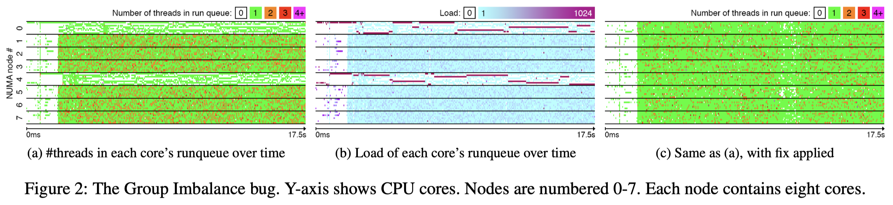

# The Linux Scheduler: a Decade of Wasted Cores

## One-line Summary

~~Linus gets roasted.~~

This paper pinpoints some performance bugs in the Linux scheduler \(especially in multi-core systems\) and proposes fixes, during which the authors developed tools for checking and understanding these bugs.

## Paper Structure Outline

1. Introduction
2. The Linux Scheduler
   1. On a single-CPU system, CFS is very simple
   2. On multi-core systems, CFS becomes quite complex
      1.  The load balancing algorithm
      2. Optimizations
3. Bugs
   1. The Group Imbalance bug
   2. The Scheduling Group Construction bug
   3. The Overload-on-Wakeup bug
   4. The Missing Scheduling Domains bug
   5. Discussion
4. Tools
   1. Online Sanity Checker
   2. Scheduler Visualization tool
5. Lessons Learned
6. Related Work 
7. Conclusion

## Background & Motivation

The Linux kernel's process scheduler underwent three main periods of evolutions: 

1. v0.01~v2.4.x: [the very first scheduler](https://dev.to/satorutakeuchi/a-brief-history-of-the-linux-kernel-s-process-scheduler-the-very-first-scheduler-v0-01-9e4)
2. v2.6.0~v2.6.22: O\(1\) scheduler
3. v2.6.23~: Completely Fair Scheduler \(CFS\)


There were also variations like the Brain Fuck Scheduler \(BFS\) which works better than CFS on desktop Linux systems with &lt;16 cores, but it does not scale well to large-scale systems \(4096 processors / NUMA\), and it had some other drawbacks so it was never merged into the mainline Linux kernel.


Modern Linux uses a Completely Fair Scheduler \(CFS\) which implements the Weighted Fair Queueing \(WFQ\) algorithm. On a single-CPU system, the CFS is really simple -- the CFS does time-slicing among running threads to achieve fair sharing. On multi-core systems, however, things get a bit messy -- To address scalability and keep the context switches fast, per-core runqueues are used, and in order for the scheduling algorithm to work correctly and efficiently, the runqueues must be kept balanced. The optimizations done by the load-balancing algorithm is complex and lead to bugs.  

## Bugs & Performance Improvement after Fixing 

### The Group Imbalance bug

> When a core attempts to steal work from another node, or, in other words, from another scheduling group, it does not examine the load of every core in that group, it only looks at the group’s average load. If the average load of the victim scheduling group is greater than that of its own, it will attempt to steal from that group; otherwise it will not. This is the exact reason why in our situation the underloaded cores fail to steal from the overloaded cores on other nodes. They observe that the average load of the victim node’s scheduling group is not any greater than their own. The core trying to steal work runs on the same node as the high-load R thread; that thread skews up the average load for that node and conceals the fact that some cores are actually idle. At the same time, cores on the victim node, with roughly the same average load, have lots of waiting threads.

The fix is simple: When the algorithm compares the load of scheduling groups, it should be comparing the minimum loads instead of the average loads. 

> If the minimum load of one scheduling group is lower than the minimum load of another scheduling group, it means that the first scheduling group has a core that is less loaded than all cores in the other group, and thus a core in the first group must steal from the second group. This algorithm ensures that no core of the second group will remain overloaded while a core of the first group has a smaller load, thus balancing the load across cores.

### The Scheduling Group Construction bug

### The Overhead-on-Wakeup bug

### The Missing Scheduling Domains bug

## Tools

## New Vocabulary

* LKML: The Linux Kernel Mailing List
* 
## Links

* [Paper PDF](https://www.ece.ubc.ca/~sasha/papers/eurosys16-final29.pdf)
* [Presentation Slides](http://www.i3s.unice.fr/~jplozi/wastedcores/files/talk.pdf)
* [Patches for Linux kernel 4.1 on GitHub](https://github.com/jplozi/wastedcores)
* [Discussion 1 on LKML](https://lkml.org/lkml/2016/4/23/194)
* [Discussion 2 on LKML](https://lkml.org/lkml/2016/4/25/176)
* [Paper reading notes](https://blog.acolyer.org/2016/04/26/the-linux-scheduler-a-decade-of-wasted-cores/) on [the morning paper](https://blog.acolyer.org/)
* [A brief history of the Linux Kernel's process scheduler: The very first scheduler, v0.01](https://dev.to/satorutakeuchi/a-brief-history-of-the-linux-kernel-s-process-scheduler-the-very-first-scheduler-v0-01-9e4)

