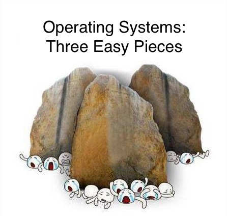

# Operating Systems Papers - Index

## Meta stuff

* Reading lists
  * [CS 736 @ UW-Madison: Advanced Operating Systems](cs-736-uw-madison-fall-2020-reading-list.md)
  * [CS 262a @ Berkeley: Advanced Topics in Computer Systems](https://ucbrise.github.io/cs262a-fall2020/)
  * [OSTEP \(Operating Systems: Three Easy Pieces\)](http://pages.cs.wisc.edu/~remzi/OSTEP/) is written by the brilliant Remzi & Andrea and each chapter is followed by a lovely reading list about the topic covered in the chapter.
  * Some reading notes by individuals:
    * [Zeyuan Hu's paper reading notes](https://zhu45.org/), with a focus on database systems
    * [An open-source reading notes in CN](https://github.com/dyweb/papers-notebook), with a focus on virtualization and distributed systems

* Some other stuff
  * [CS 262a @ Berkeley Fall 2020 class summary slides](https://ucbrise.github.io/cs262a-fall2020/notes/26-Class-Summary.pdf)
  * [Systems Benchmarking Crimes](https://www.cse.unsw.edu.au/~gernot/benchmarking-crimes.html)

## Table of Contents

### File and Storage Systems

| Title | Venue |
| :--- | :--- |
| [FFS: A Fast File System for UNIX](ffs-a-fast-file-system-for-unix.md) | ACM Transactions on Computer Systems ‘84 |
| [NFS: Sun's Network File System](nfs-suns-network-file-system.md) | USENIX '86 |
| [RAID: A Case for Redundant Arrays of Inexpensive Disks](raid-a-case-for-redundant-arrays-of-inexpensive-disks.md) | SIGMOD ‘88 |
| [LFS: The Design and Implementation of a Log-Structured File System](lfs-the-design-and-implementation-of-a-log-structured-file-system.md) | ACM Transactions on Computer Systems ‘92 |
| [SnapMirror: File-System-Based Asynchronous Mirroring for Disaster Recovery](snapmirror-file-system-based-asynchronous-mirroring-for-disaster-recovery.md) | FAST '02 |
| [Venti: A New Approach to Archival Storage](venti-a-new-approach-to-archival-storage.md) | FAST '02 |
| [ARC: A Self-Tuning, Low Overhead Replacement Cache](arc-a-self-tuning-low-overhead-replacement-cache.md) | FAST '03 |
| [RDP: Row-Diagonal Parity for Double Disk Failure Correction](rdp-row-diagonal-parity-for-double-disk-failure-correction.md) | FAST '04 |
| [Data Domain: Avoiding the Disk Bottleneck in the Data Domain Deduplication File System](data-domain-avoiding-the-disk-bottleneck-in-the-data-domain-deduplication-file-system.md) | FAST '08 |
| [Mnemosyne: Lightweight Persistent Memory](../drafts/mnemosyne-lightweight-persistent-memory.md) | ASPLOS '11 |
| [A File is Not a File: Understanding the I/O Behavior of Apple Desktop Applications](a-file-is-not-a-file-understanding-the-i-o-behavior-of-apple-desktop-applications.md) | SOSP '11 |
| [OptFS: Optimistic Crash Consistency](optfs-optimistic-crash-consistency.md) | SOSP '13 |
| [All File Systems Are Not Created Equal: On the Complexity of Crafting Crash-Consistent Applications](all-file-systems-are-not-created-equal-on-the-complexity-of-crafting-crash-consistent-applications.md) | OSDI '14 |
| [The Unwritten Contract of Solid State Drives](the-unwritten-contract-of-solid-state-drives.md) | EuroSys '17 |
| [From WiscKey to Bourbon: A Learned Index for Log-Structured Merge Trees](from-wisckey-to-bourbon-a-learned-index-for-log-structured-merge-trees.md) | OSDI '20 |
| [CheckFreq: Frequent, Fine-Grained DNN Checkpointing](../../machine-learning-systems/index/checkfreq-frequent-fine-grained-dnn-checkpointing.md) | FAST '21 |

### Process Synchronization and Scalability \( 🥵 \)

| Title | Venue |
| :--- | :--- |
|  |  |

### Scheduling

| Title | Venue |
| :--- | :--- |
| [Scheduler Activations: Effective Kernel Support for the User-Level Management of Parallelism](scheduler-activations-effective-kernel-support-for-the-user-level-management-of-parallelism.md) | ACM SIGOPS '91 |
| [Lottery Scheduling: Flexible Proportional-Share Resource Management](lottery-scheduling-flexible-proportional-share-resource-management.md) | OSDI '94 |
| [Resource Containers: A New Facility for Resource Management in Server Systems](resource-containers-a-new-facility-for-resource-management-in-server-systems.md) | OSDI '99 |
| [The Linux Scheduler: A Decade of Wasted Cores](the-linux-scheduler-a-decade-of-wasted-cores.md) | EuroSys '16 |
| [Monotasks: Architecting for Performance Clarity in Data Analytics Frameworks](monotasks-architecting-for-performance-clarity-in-data-analytics-frameworks.md) | SOSP '17 |
| [Gandiva: Introspective Cluster Scheduling for Deep Learning](../../machine-learning-systems/index/gandiva-introspective-cluster-scheduling-for-deep-learning.md) | OSDI '18 |
| [Tiresias: A GPU Cluster Manager for Distributed Deep Learning](../../machine-learning-systems/index/tiresias-a-gpu-cluster-manager-for-distributed-deep-learning.md) | NSDI '19 |
| [Themis: Fair and Efficient GPU Cluster Scheduling](../../machine-learning-systems/index/themis-fair-and-efficient-gpu-cluster-scheduling.md) | NSDI '20 |

### OS Structure and Virtual Machines

| Title | Venue |
| :--- | :--- |
| [Disco: Running Commodity Operating Systems on Scalable Multiprocessors](disco-running-commodity-operating-systems-on-scalable-multiprocessors.md) | SOSP '97 |
| [Memory Resource Management in VMWare ESX Server](memory-resource-management-in-vmware-esx-server.md) | OSDI '02 |
| [ReVirt: Enabling Intrusion Analysis through Virtual Machine Logging and Replay](revirt-enabling-intrusion-analysis-through-virtual-machine-logging-and-replay.md) | OSDI '02 |
| [Biscuit: The benefits and costs of writing a POSIX kernel in a high-level language](biscuit-the-benefits-and-costs-of-writing-a-posix-kernel-in-a-high-level-language.md) | OSDI '18 |
| [LegoOS: A Disseminated, Distributed OS for Hardware Resource Disaggregation](legoos-a-disseminated-distributed-os-for-hardware-resource-disaggregation.md) | OSDI '18 |

## To Read

### To move from local note to GitBook

#### File and Storage Systems

* [ ] Mnemosyne: Lightweight Persistent Memory
* [ ] Level Hash: Write-Optimized and High-Performance Hashing Index Scheme for Persistent Memory

#### Process Synchronization and Scalability

* [ ] Monitors: An Operating System Structuring Concept
* [ ] Mesa: Experiences with Processes and Monitors in Mesa
* [ ] Scalability Analysis: An Analysis of Linux Scalability to Many Cores
* [ ] Scalable Commutativity: The Scalable Commutativity Rule: Designing Scalable Software for Multicore Processors
* [ ] \(Delegation/RCL\) Remote Core Locking: Migrating Critical-Section Execution to Improve the Performance of Multithreaded Applications
* [ ] Shuffle Locks: Scalable and Practical Locking with Shuffling
* [ ] Arachne: Core-Aware Thread Management

#### Scheduling

* [ ] SEDA: An Architecture for Well-Conditioned, Scalable Internet Services
* [ ] TAM: Principled Schedulability Analysis for Distributed Storage Systems using Thread Architecture Models

#### OS Structure and Virtual Machines

* [ ] THE: The Structure of "THE" Multiprogramming System
* [ ] Nucleus: The Nucleus of a Multiprogramming System
* [ ] Exokernel: An Operating System Architecture for Application-Level Resource Management
* [ ] Arrakis: The Operating System is the Control Plane
* [ ] UNIX: The UNIX Time-Sharing System

### To read

* [ ] seL4: Formal Verification of an OS Kernel

