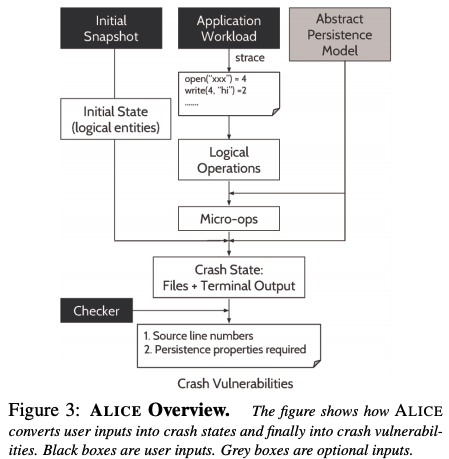
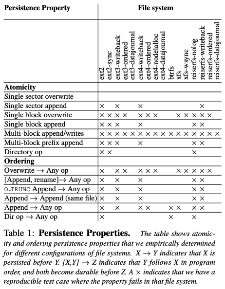
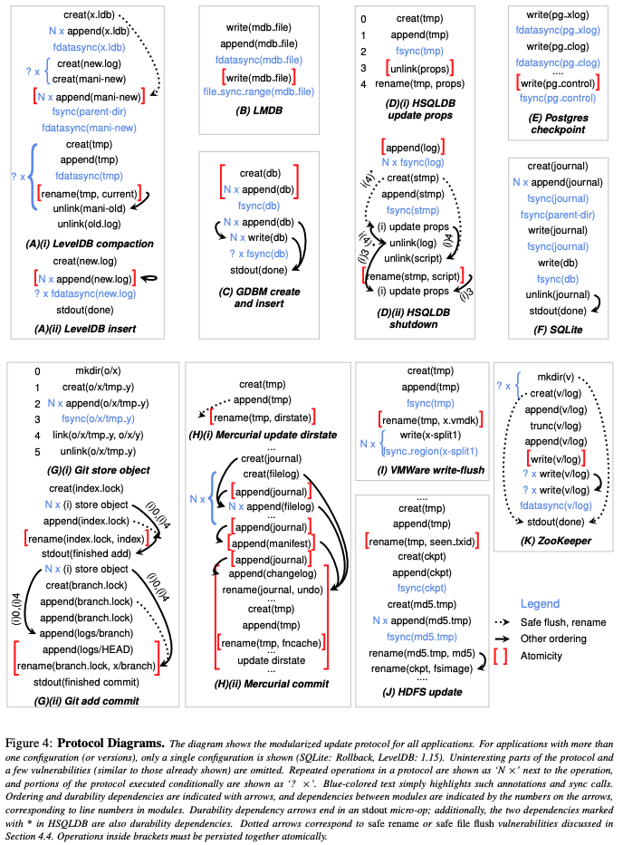
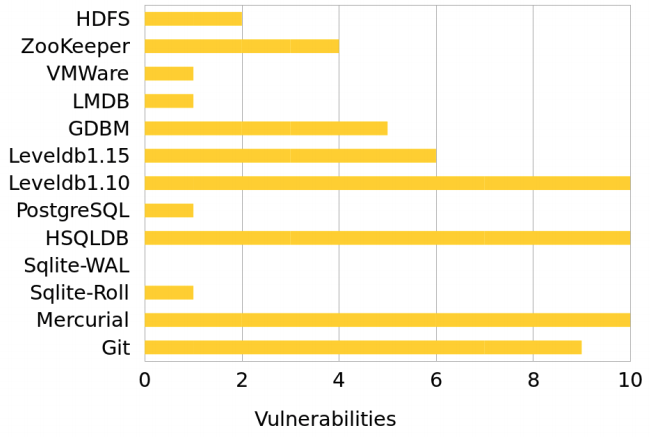
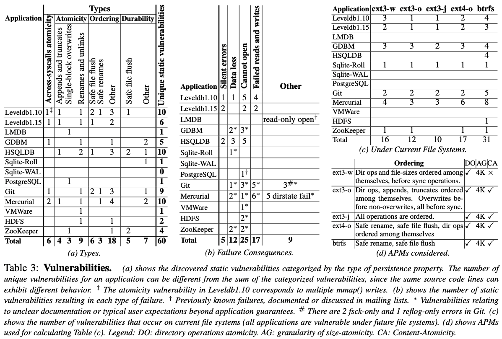

# All File Systems Are Not Created Equal: On the Complexity of Crafting Crash-Consistent Applications

## One-line Summary

This paper presents a comprehensive study of file system persistence properties and modern application crash inconsistency vulnerabilities. Two tools, BOB and ALICE, are presented to analyze FS-level and application-level vulnerabilities.

## Paper Structure Outline

1. Introduction
2. Persistence Properties
   1. An Example
   2. Study and Results
      1. Atomicity
      2. Ordering
   3. Summary
3. The Application-Level Intelligent Crash Explorer \(ALICE\)
   1. Usage
   2. Crash States and APMs
      1. Logical Operations
      2. Abstract Persistence Models
      3. Constructing crash states.
   3. Finding Application Requirements
   4. Static Vulnerabilities
   5. Implementation
   6. Limitations
4. Application Vulnerabilities
   1. Workloads and Checkers
   2. Overview
      1. Databases and Key-Value Stores
      2. Version Control Systems
      3. Virtualization and Distributed Systems
   3. Vulnerabilities Found
   4. Common Patterns
      1. Atomicity across System Calls
      2. Atomicity within System Calls
      3. Ordering between System Calls
      4. Durability
      5. Summary
   5. Impact on Current File Systems
   6. Evaluating New File-System Designs
   7. Discussion
5. Related Work
6. Conclusion

## Background & Motivation

To provide crash consistency for update-in-place file systems, journaling is performed. A high-level overview of journaling:

* Intuition
  * Before updating the file system, write a note describing the update
  * Make sure note is safely on disk
  * Once the note is safe, update the file system
  * If interrupted, read the note and redo updates
* Protocol
  * Write the data \(no pointers to it\) - Optional
  * Write the note: Journal Metadata
  * Make sure the note is durably written: Journal Commit
  * Update the in-place metadata: Checkpointing
  * Replay the note: Recovery

The motivation for this work is that applications may not be aware of consistency guarantees for different file systems or even the same file system with different configurations. The authors categorize file system persistency properties and study the differences among widely deployed file systems \(ext3, ext4, btrfs\). It then studies application-level crash inconsistency vulnerabilities.

## Design and Implementation

### BOB \(Block Order Breaker\)

BOB analyzes syscall persistence properties on a **file system**. Here's how BOB works:

1. Runs user-level workloads stressing the property
2. Records block-level trace of the workload
3. Reconstructs disk-states possible on a power-loss
   1. All states possible if disk-cache does not re-order
   2. A few states where disk-cache re-orders
4. Run FS recovery, verify property on each disk-state \(atomicity & ordering\)

### ALICE \(Application-Level Intelligent Crash Explorer\)

ALICE analyzes **application** update protocols and finds crash vulnerabilities \(across all file systems\). ALICE runs an application and collects its syscall trace \(which represents an execution of the application's update protocol\). The traces are then converted into a sequence of logical operations, which is then used to generates possible disk states according to characteristics of these syscalls and produces all possible intermediate disk states. If any of these disk states violate any application invariant, then this is considered a crash vulnerability.

## Evaluation

### File systems

The conclusion for the file system study is that applications should not rely on persistence properties. Also, testing applications on a specific file system is not enough.

### Applications

Applications from different domains are studied \(relational & non-relational databases, version control, distributed services, virtualization\). Many of the vulnerabilities will bring trouble over some modern file system configurations \(e.g., content-atomic appends over no-delayed-allocation file systems\).

## New Vocabulary

* APM: Abstract Persistence Model

## Links

* [Paper PDF](https://www.usenix.org/system/files/conference/osdi14/osdi14-paper-pillai.pdf)
* [Presentation Video at OSDI '14](https://www.usenix.org/conference/osdi14/technical-sessions/presentation/pillai)
* [Presentation Slides at OSDI '14](https://www.usenix.org/sites/default/files/conference/protected-files/osdi14_slides_pillai.pdf)

