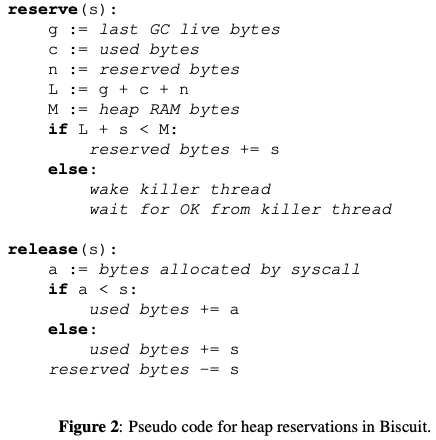

# Biscuit: The benefits and costs of writing a POSIX kernel in a high-level language

## One-line Summary

This paper analyzes \(duh\) the benefits and costs of writing a POSIX kernel in a high-level language, Go.

## Paper Structure Outline

1. Introduction
2. Related work
3. Motivation
   1. Why C?
   2. Why an HLL?
4. Overview
5. Garbage Collection
   1. Go's collector
   2. Biscuit's heap size
6. Avoiding heap exhaustion
   1. Approach: reservations
   2. How Biscuit reserves
   3. Static analysis to find s
      1. Basic MAXLIVE operation
      2. Handling loops
      3. Kernel threads
   4. Limitations
   5. Heap exhaustion summary
7. Implementation
8. Evaluation
   1. Biscuit's use of HLL features
   2. Potential to reduce bugs
   3. Experimental Setup
   4. HLL tax
   5. GC delays
   6. Sensitivity to heap size
   7. Go versus C
      1. Ping-pong
      2. Page-faults
   8. Biscuit versus Linux
   9. Handling kernel heap exhaustion
   10. Lock-free lookups
9. Discussion and future work
10. Conclusions

## Background & Motivation

The main reason for using low level languages like C to implement a kernel is that C supports low-level techniques that can help performance \(pointer arithmetic, explicit memory allocation, etc.\).

High level languages \(HLL\), on the other hand, have some potential advantages compared to C:

1. Automatic memory management: reduces programmer effort and use-after-free bugs
2. Type-safety: detects bugs
3. Runtime typing and method dispatch: helps with abstraction
4. Language support for threads and synchronization eases concurrent programming

With the idea of exploring the possibility of using a HLL to implement a monolithic POSIX-style kernel in mind, the authors present Biscuit, a kernel written in Go, which has good performance.

## Design and Implementation

The Biscuit kernel is written using 27583 lines of Go, 1546 lines of assembly, and no C. Biscuit provides 58 syscalls and it has enough POSIX compatibility to run some existing server programs \(NGINX, Redic, etc.\).

### Garbage collection

Biscuit uses Go's collector, which suspends ordinary execution on all cores \("stop-the-world" pause of ~10μs\) twice during a collection. This hurts tail latency the most, and it's especially bad for machines that are dependent on pauses \(e.g., datacenters\).

### Avoiding heap exhaustion

Heap exhaustion refers to live kernel data completely filling the RAM allocated for the heap. Waiting for memory in allocator might lead to deadlocks; Checking and handling allocation failure \(like C kernels\) is difficult to get right, and Go does not expose failed allocations. Biscuit uses reservations as a solution:



A syscall does not start until either it can reserve enough heap memory or a killer thread frees up some memory. To execute a syscall, 

```text
reserve()
    (no locks held)
    evict, kill
    wait...
sys_read()
    ...
unreserve()
```

## Evaluation

Some missing features of Biscuit:

* Scheduling priority \(relies on Go runtime scheduler\)
* Does not handle large multicore machines or NUMA
* Does not swap or page out to disk
* Does not implement reverse page mappings \(revoke shared pages\)
* Security features \(Users, access control lists, address space randomization\)
* 58 out of 300-400 syscalls

The experiments used three kernel-intensive applications: CMailbench, NGINX, and Redis.



* Tput: throughput in application requests per second
* Prologue cycles: the fraction of total time used by compiler-generated code at the start of each function that checks whether the stack must be expanded, and whether the garbage collector needs a stop-the-world pause
* Safety cycles: the cost of runtime checks for nil pointers, array and slice bounds, divide by zero, and incorrect dynamic casts
* Alloc cycles: the time spent in the Go allocator, examining free lists to satisfy allocation requests \(but not including concurrent collection work\)



## New Vocabulary

* [Goroutines](https://www.geeksforgeeks.org/goroutines-concurrency-in-golang/)
* CVE: Common Vulnerabilities and Exposures
* Code path: the set of specific instructions that are actually executed during a single run of a program or program fragment.

## Links

* [Paper PDF](https://www.usenix.org/system/files/osdi18-cutler.pdf)
* [Presentation Audio at OSDI '18](https://www.usenix.org/conference/osdi18/presentation/cutler)
* [Presentation Slides](https://www.usenix.org/sites/default/files/conference/protected-files/osdi18_slides_cutler.pdf)


