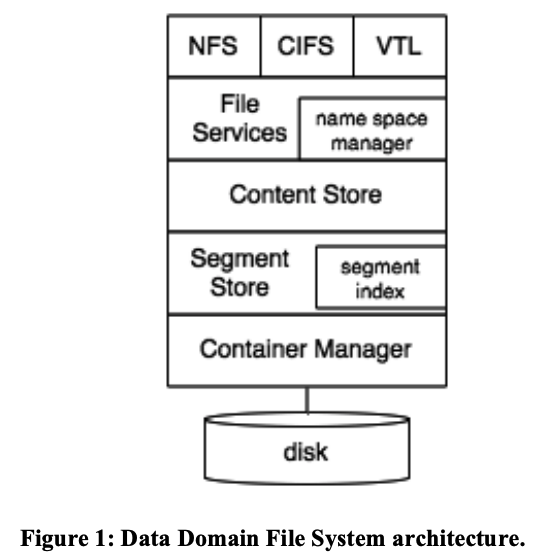
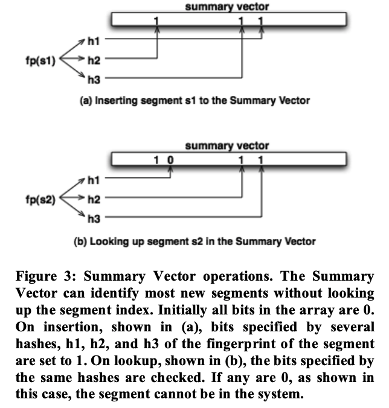
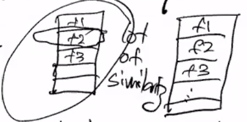
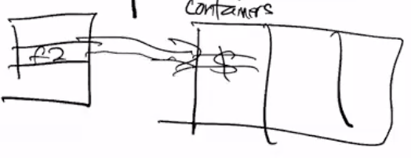
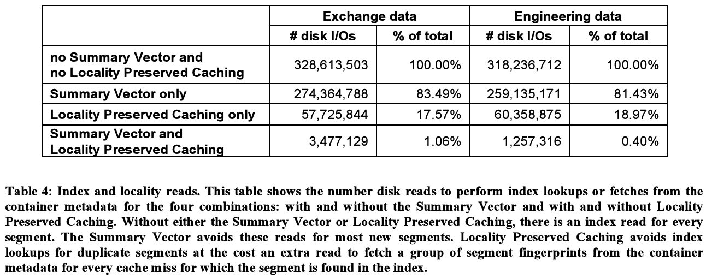

# Data Domain: Avoiding the Disk Bottleneck in the Data Domain Deduplication File System

## One-line Summary

The Data Domain Deduplication File System introduces some techniques to relieve the disk bottleneck in previous works. The techniques combined can remove 99% of the disk accesses for deduplication.

## Paper Structure Outline

1. Introduction
2. Challenges and Observations
   1. Variable vs. Fixed Length Segments
   2. Segment Size
   3. Performance-Capacity Balance
   4. Fingerprint vs. Byte Comparisons
3. Deduplication Storage System Architecture
   1. Content Store
   2. Segment Store
   3. Container Manager
4. Acceleration Methods
   1. Summary Vector
   2. Stream-Informed Segment Layout
   3. Locality Preserved Caching
   4. Accelerated Segment Filtering
5. Experimental Results
   1. Results with Real World Data
   2. I/O Savings with Summary Vector and Locality Preserved Caching
   3. Throughput
   4. Discussion
6. Related Work
7. Conclusions

## Background & Motivation

The throughput for data deduplication in [Venti](venti-a-new-approach-to-archival-storage.md) was bad. This work aims to resolve those issues.

## Design and Implementation

The three main performance enhancement techniques are:

1. Summary vectors
2. Stream-informed layout
3. Locality-preserved caching

The Data Domain File System also featured a layered file system architecture.

### Layered file system

* Content Store: Manages data in files; Breaks data into segments; Does the fingerprinting
* Segment Store: Maps segment descriptors (fingerprints) to data; Performs deduplication; Keeps track of references, updates segment index; Compresses segments and pushes to container layer
* Container Manager: Provides container abstraction; Write fixed-sized containers entirely

### Summary vector (bloom filter)

This avoids going to disk and writing data if the data already exists. Bloom filters are used to check the fingerprint. It may produce false positives but no false negatives (i.e. the summary vector will not tell you that an existing fingerprint doesn't exist), so it's only a slight performance problem. 

### Stream-informed layout

The motivation is that fingerprints are random, distributed, but the same group of fingerprints is likely to occur at the same time in the future. The idea is to dedicate containers to holding segments & fingerprints in the logical order. This improves locality and fewer number of I/Os by the container manager.

### Locality-preserved caching

An extension of the idea that motivated stream-informed layout. We divide the cache into container-sized units and cache on the granularity of containers. If we need one of the items in the container, we will likely need all of them as well.

### Procedures of a segment write

1. Check if the fingerprint is in the segment cache. If yes, then we are done. Else, continue to step 2.
2. Check the summary vector to see if the data is already written.
   1. If not (new data), then append it to the current container (for locality with the other data in the container). Once the container is full, it is passed off to the container manager.
   2. If yes (old data), it might be a false positive so we check if it really exists.
      1. Check the index, if it's really in there (duplicate), insert it into the segment cache along with all the other fingerprints in the container.
      2. Otherwise, go to step 2.1 (append to the current container).

## Evaluation

## New Vocabulary

* [Bloom filter](https://www.youtube.com/watch?v=kfFacplFY4Y\&ab_channel=SpanningTree): A space-efficient probabilistic data structure that is used to test whether an element is a member of a set.

## Links

* [Paper PDF](https://www.usenix.org/legacy/events/fast08/tech/full_papers/zhu/zhu.pdf)
* [Presentation Video at FAST '08](https://www.usenix.org/conference/fast-08/avoiding-disk-bottleneck-data-domain-deduplication-file-system)
* [Presentation Audio at FAST '08](https://c59951.ssl.cf2.rackcdn.com/legacy_media/fast08/tech/full_papers/zhu/zhu.mp3)


Prof. Andrea Arpaci-Dusseau's course notes on Data Deduplication

