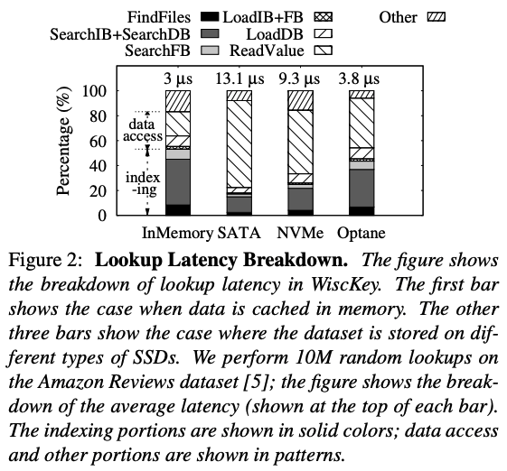
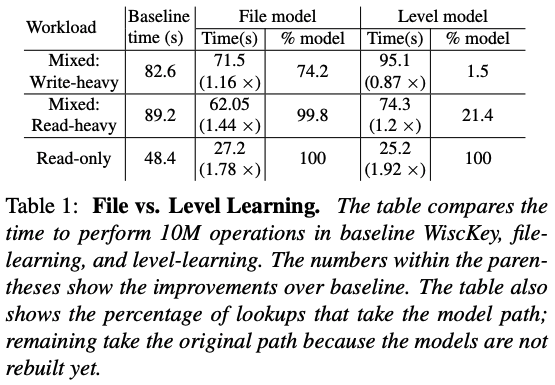
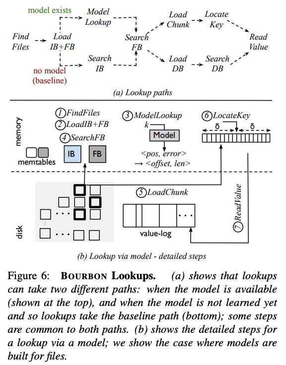
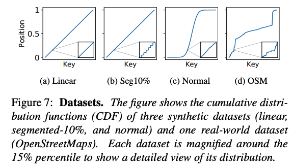
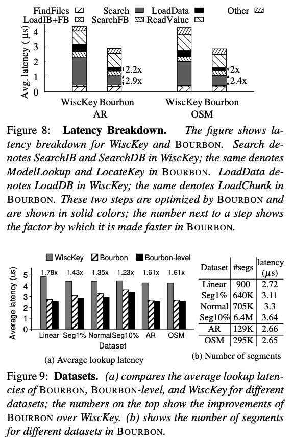
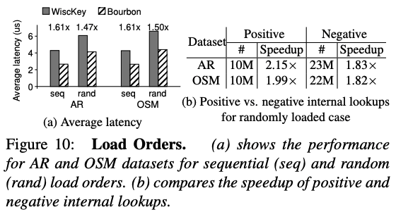
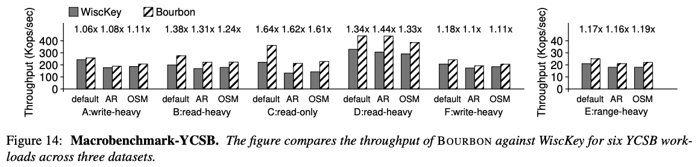
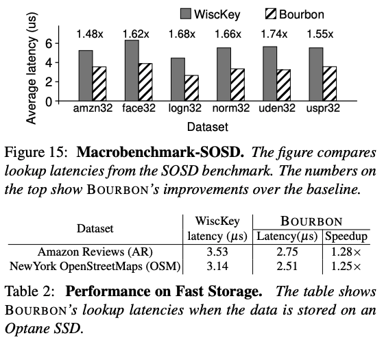

# From WiscKey to Bourbon: A Learned Index for Log-Structured Merge Trees

## One-line Summary

Bourbon is a log-structured merge tree that utilizes machine learning to provide fast lookups.

## Paper Structure Outline

1. Introduction
2. Background
   1. LSM and LevelDB
   2. WiscKey
3. Learned Indexes: a Good Match for LSMs?
   1. Learned Indexes: Beneficial Regimes
   2. Learned Indexes with Writes
4. Bourbon Design
   1. Learning the Data
   2. Supporting Variable-size Values
   3. Level vs. File Learning
   4. Cost vs. Benefit Analyzer
      1. Wait Before Learning
      2. To Learn a File or Not
   5. Bourbon: Putting it All Together
5. Evaluation
   1. Which Portions does Bourbon Optimize?
   2. Performance under No Writes
      1. Datasets
      2. Load Orders
      3. Request Distributions
   3. Range Queries
   4. Efficacy of Cost-benefit Analyzer with Writes
   5. Real Macrobenchmarks
      1. YCSB
      2. SOSD
   6. Performance on Fast Storage
   7. Performance with Limited Memory
   8. Error Bound and Space Overheads
6. Related Work
7. Conclusions

## Background & Motivation

The work is based on an existing LSM system, WiscKey, which is significantly faster than LevelDB and RocksDB. The authors analyzed WiscKey and derived five learning guidelines that aid an LSM system to successfully incorporate learned indexes. These guidelines are applied to build Bourbon, a learned-index implementation of WiscKey.

## Design and Implementation

### Five learning guidelines

1. Favor learning files at lower levels (which live longer)
2. Wait before learning a file (very short-lived files in every level due to consecutive compactions to newly generated files)
3. Do not neglect files at higher levels (serve more internal lookups)
4. Be workload- and data-aware (#lookups vary a lot in different scenarios)
5. Do not learn levels for write-heavy workloads (level changes quickly)

### Beneficial regimes

Learned indexes can only speed up indexing time.

### Bourbon Learning

Bourbon uses piecewise linear regression (PLR) to model the data as it has low overheads during learning and lookups, and the space overhead is small as well. Bourbon can learn individual sstables files (file learning) or entire levels (level learning). Level learning can be beneficial for read-only workloads, while for mixed workloads, level learning performs worse than file learning.

### Cost-benefit analyzer (CBA)

The motivation for an online Cost vs. Benefit Analyzer (CBA) is to filter out short-lived files as they are not worth learning. Doing so wastes resources and has little benefit. CBA uses stats of previous files at the same level.

To filter out short-lived files, Bourbon waits for a time threshold, Twait, before learning a file. The max time to learn a file is \~40ms, thus Bourbon sets Twait to be 50ms. However, learning a long-lived file may not be beneficial (and vice versa). Intuitively, as long as the benefit of the model (B_model) outweighs the cost of building the model (C_model), learning a file is profitable.

#### Estimating the cost (C_model)

If we assume learning happens in the background (using idle cores), then C_model is 0. Bourbon takes a conservative approach, though, and assumes that the learning threads will interfere and cause some slow down. As a result, we define Cmodel to be equal to T_build, the time to train the PLR model for a file. As T_build is linearly proportional to the number of data points in a file, we define T_build to be the product of (1) the number of data points in the file and (2) the avg time to train a data point (measured offline).

#### Estimating the benefit (B_model)

Bourbon defines the benefit of learning a file to be:

$$
B_{model} = (T_b - T_m) * N
$$


* T_b: Average time for the lookup in baseline
* T_m: Average time for the lookup in model paths
* N: Number of lookups the file serves in its lifetime


Then, we divide the internal lookups into negative and positive ones as most negative lookups terminate at the filer.

$$
B_{model} = ((T_{n.b} - T_{n.m}) * N_n) + ((T_{p.b} - T_{p.m}) * N_p)
$$


* N_n & N_p: Number of negative and positive internal lookups, respectively
* T\_(n.b) and T\_(p.b): Time in the baseline path for negative and positive internal lookups, respectively
* T\_(n.m) and T\_(p.m): Model counterparts


To estimate the number of lookups (N_n & N_p) and the time the lookups take (T\_{n.b} & T\_{p.b}), CBA keeps track of the statistics of files that (1) have lived their lifetimes and (2) are at the same level (as stats vary significantly across levels).

Estimation of the above quantities are done during T_wait:

* T\_(n.b) and T\_(p.b): DuringTwait, lookups are served in the baseline path. These times are used to estimate Tn.b & Tp.b.
* T\_(n.m) and T\_(p.m): Estimated as the avg of those of all other files at the same level.
* N_n & N_p: Same as above but normalized by a factor f (f = s / s’: s is the size of the file, while s’ is the avg size of files at this level). While estimating the above quantities, short-lived files are filtered out.

If C_model < B_model, a file will be learned. If multiple files are chosen to be learned at the same time, they are put on a max priority queue so that files that would deliver the most benefit are prioritized.

Possible directions for future improvements include:

* Better estimations of N_n, N_p, T\_(n.m) & T\_(p.m)
* Develop a model of T_build on-line or calculate C_build such that it is not simply T_build
* Sort the work queue by some function other than B_model - C_model

## Evaluation

## New Vocabulary

* [Log-structured merge trees](https://en.wikipedia.org/wiki/Log-structured_merge-tree)

## Links

* [Paper PDF](https://www.usenix.org/system/files/osdi20-dai\_0.pdf)
* [Presentation video at OSDI '20](https://www.youtube.com/watch?v=EUxEx5hwLXk)
* [Presentation slides at OSDI '20](https://www.usenix.org/sites/default/files/conference/protected-files/osdi20\_slides_dai.pdf)
* Thanks to Yifan Dai and Yien Xu for the paper review notes!


Prof. Andrea's course slides on the SSD paper and Bourbon

