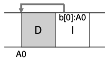
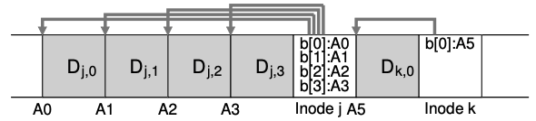
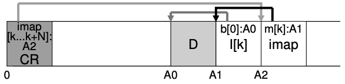
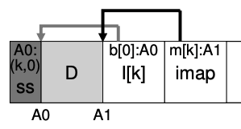
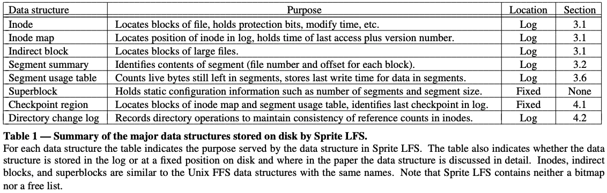
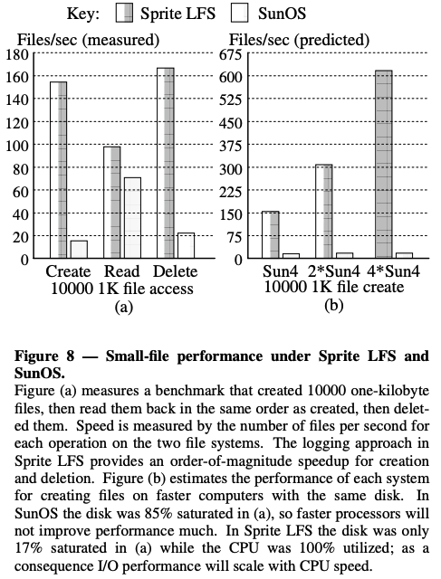
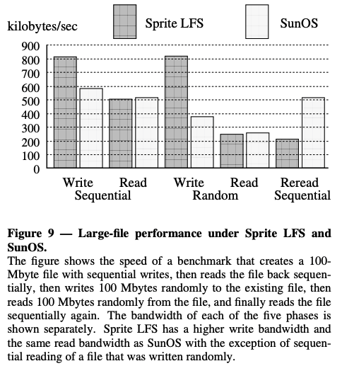
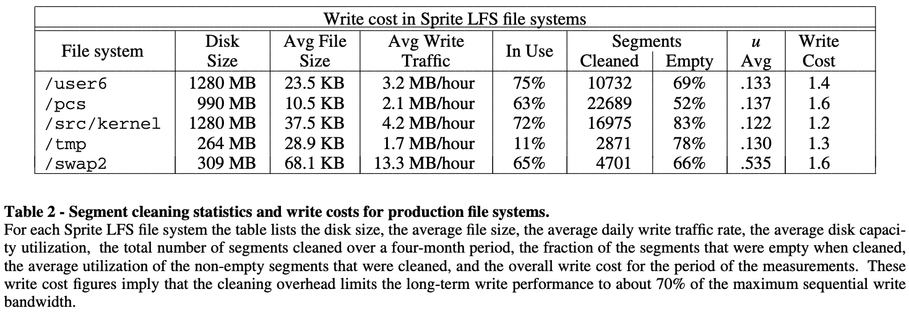

# LFS: The Design and Implementation of a Log-Structured File System

## One-line Summary

A new file system structure that tries to use the disk sequentially using log-like structures.

## Paper Structure Outline

1. Introduction
2. Design for file systems of the 1990's
   1. Technology
   2. Workloads
   3. Problems with existing file systems
3. Log-structured file systems
   1. File location and reading
   2. Free space management: segments
   3. Segment cleaning mechanism
   4. Segment cleaning policies
   5. Simulation results
   6. Segment usage table
4. Crash recovery
   1. Checkpoints
   2. Roll-forward
5. Experience with the Sprite LFS
   1. Micro-benchmarks
   2. Cleaning overheads
   3. Crash recovery
   4. Other overheads in Sprite LFS
6. Related Work
7. Conclusion

## Background & Motivation

The motivation for LFS was because of the explosive improvements of system memories and processor speed and a relatively slow improvement of disk transfer bandwidth and access time, which made I/O a bottleneck. Also, the new workloads of doing small, random reads \(and the poor performance of existing file systems in doing so compared to the sequential I/O, and the fact that RAID-5 is especially bad with small random reads\) also contributed to the motivation. The idea, then, is to have the file system use the disk purely sequentially.

## Design and Implementation

The new type of file system proposed in this paper, Log-structured File System \(LFS\), has the following contributions:

* Log structure: LFS converts small synchronous writes into asynchronous sequential writes. When writing to disk, LFS first buffers all updates in an in-memory segment. When a segment is full, it is written to free locations on the disk in one long, sequential transfer.
* Garbage collection: Low-overhead segment cleaning mechanisms that increase the compactness of the contents on the disk.
* Crash recovery: This is fast and intuitive due to the nature of LFS. It occasionally checkpoints the imap to disk, and it uses two checkpoint regions to ensure consistency.

### Log structure



Writing to disk sequentially is not enough: Writing to two blocks right next to each other may actually incur the overhead of most of a rotation. What we actually want is to issue a large number of contiguous writes to the drive. LFS uses an ancient technique, write buffering \(into large chunks called segments\), to resolve this issue. 



LFS uses the inode map \(imap\) to locate inodes. The imap takes an inode number and produces the disk address of the most recent version of the inode. Finally, we also have a checkpoint region \(CR\) that contains pointers to the latest pieces of the inode map. The CR is only updated periodically.



### Garbage collection

While writes are efficient, old, garbage data are scattered across the disk. LFS keeps only the latest live version of a file by periodically cleaning the garbage. LFS reclaims segments, not individual inodes or data blocks. The LFS cleaner reads in M existing segments, compacts their contents into N new segments \(N &lt; M\), and then writes the N segments to disk in new locations. The old M segments are then freed and are available for use for later writes.

#### Mechanism: Determining which blocks are alive



With the SS block and the imap, it is straightforward to determine whether a block is live or dead:

```text
(N, T) = SegmentSummary[A]
inode = Read(imap[N})
if (inode[T] == A):
    // block D is alive
else:
    // block D is garbage
```

#### Policy: How often should the cleaner run, and which segments should it pick?

* **When**: Periodically/during idle time/when the disk is full
* **Which**: Challenging! In the original paper, the authors proposed hot and cold segments. Cold segments are cleaned sooner and hot segments are cleaned later. However, this is not perfect: see [this paper](https://homes.cs.washington.edu/~tom/pubs/lfs-adapt.html) for an explanation and a better heuristic.

### Crash recovery

1. **Checkpoint**: Upon recovery, reads CR to find most imap pointers and segment tail. To address the problem of crashing during checkpointing, two CRs are used, and only one is overwritten at a time. 
2. **Roll-forward**: Thank you, database community! This technique scans through the log segments that were written after the last checkpoint.

### Implementation

Sprite LFS is a prototype LFS that outperforms the current UNIX file systems by an order of magnitude for small-file writes while matching or exceeding UNIX performance for reads and large writes.



## Evaluation







## Links

* [Paper PDF](https://people.eecs.berkeley.edu/~brewer/cs262/LFS.pdf)
* [LFS in OSTEP](http://pages.cs.wisc.edu/~remzi/OSTEP/file-lfs.pdf)
* [LFS in CS 537 @ UW-Madison](http://pages.cs.wisc.edu/~shivaram/cs537-sp20-notes/lfs/cs537-lfs-notes.pdf)

