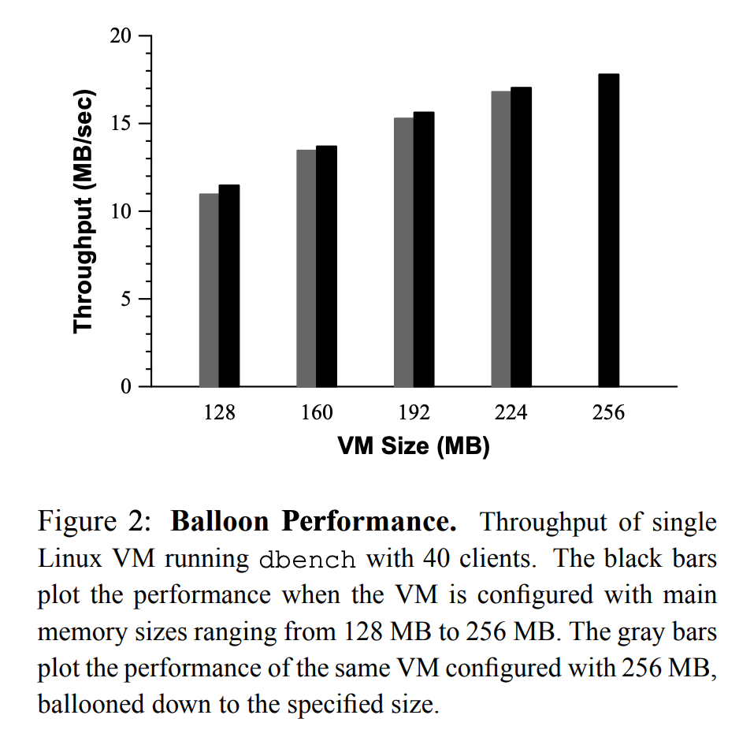
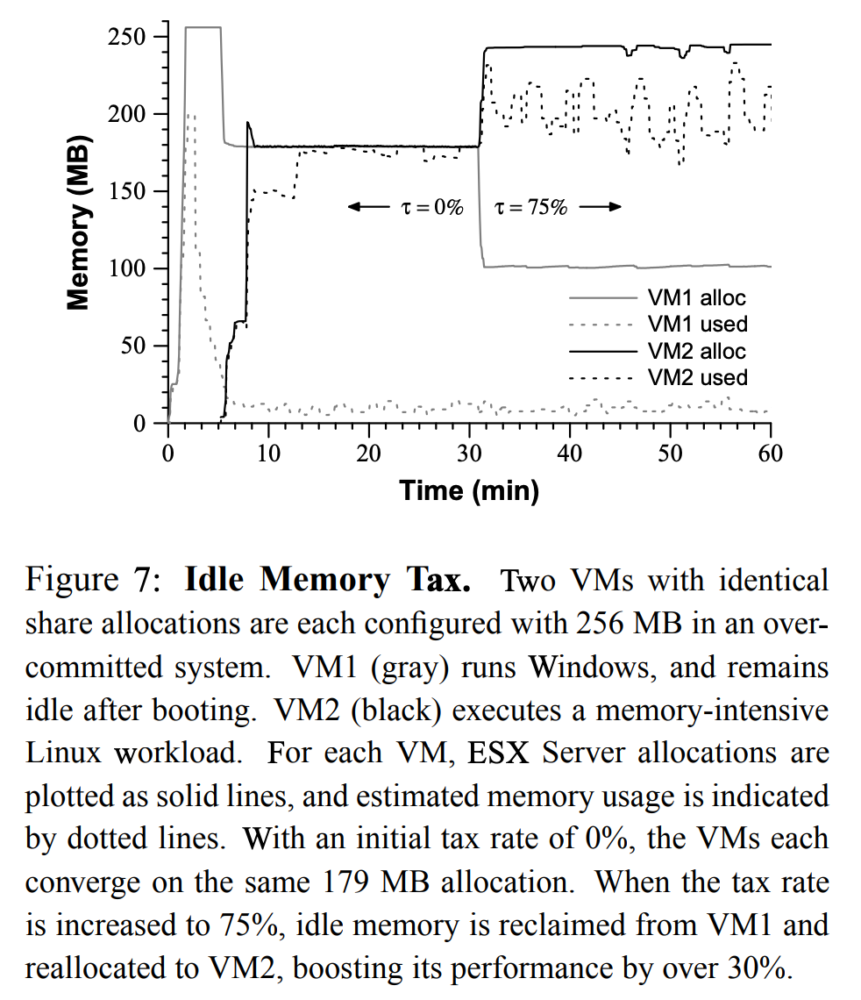
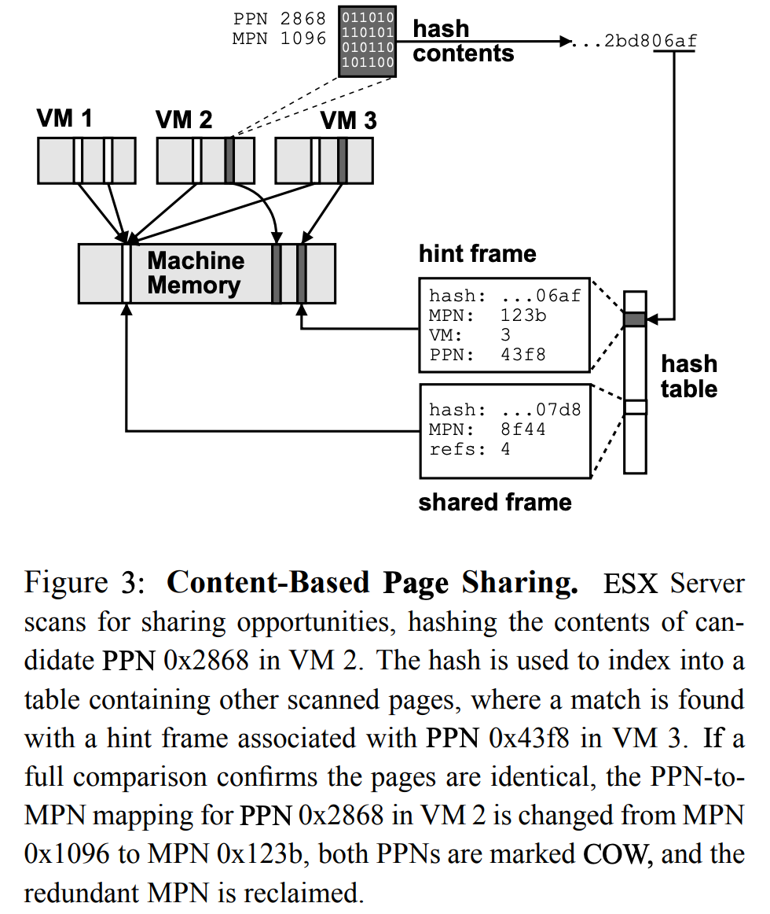
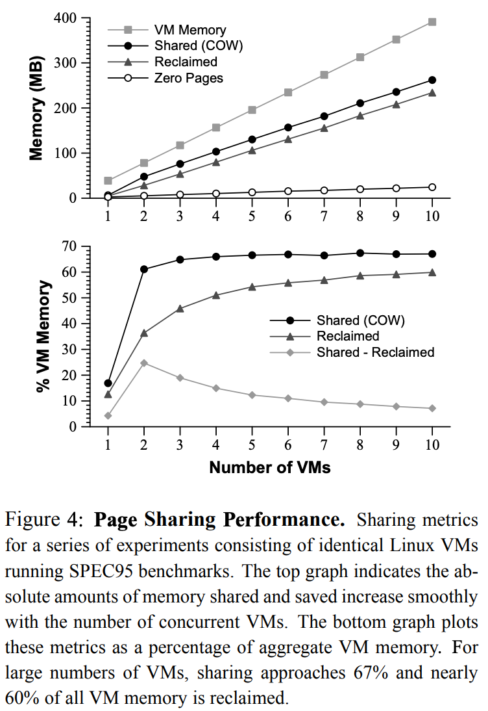

# Memory Resource Management in VMware ESX Server

### One-liner Summary

This paper introduced some mechanisms and policies for better memory management in ESX Servers.

### Paper Structure Outline

1. Introduction
2. Memory Virtualization
3. Reclamation Mechanisms
   1. Page Replacement Issues
   2. Ballooning
   3. Demand Paging
4. Sharing Memory
   1. Transparent Page Sharing
   2. Content-Based Page Sharing
   3. Implementation
5. Shares cs. Working Sets
   1. Share-Based Allocation
   2. Reclaiming Idle Memory
   3. Measuring Idle Memory
   4. Experimental Results
6. Allocation Policies
   1. Parameters
   2. Admission Control
   3. Dynamic Reallocation
7. I/O Page Remapping
8. Related Work
9. Conclusions

### Background & Motivation

This paper attempts to resolve some issues in existing Virtual Machine Managers \(VMMs\) by introducing several novel mechanisms and policies to manage memory. 

### Design and Implementation

Several novel techniques and mechanisms are presented.

#### Ballooning

This technique allows memories to be reclaimed by ESX Servers from the guest OS. When a VM is claimed memory, the ballooning technique persuades the guest OS into cooperating with it. A balloon module is loaded into the guest OS as a pseudo-device driver or kernel service. When the balloon is inflated \(by pinning physical pages\), the guest OS gets pressured and invokes its own memory management algorithms. Based on the amount of remaining memory, the guest OS either returns memory from its free list or pages out some particular pages to its own virtual disk. In contrast, when a balloon is deflated, the guest OS gets to use more memory.

#### Idle Memory Tax

Idle clients can hoard memory while active clients without enough memory suffer severe memory pressure. This technique basically charges a client more for an idle page than for one it is actively using, preventing the aforementioned scenario from happening when memory is scarce. To estimate the fraction of active memory of each virtual machine, ESX Server uses a statistical sampling approach to obtain estimates.

#### Content-Based Page Sharing

To achieve page sharing, Disco needs to make interface changes in the guest OS. In this paper, ESX Server finds identical pages between VMs by scanning for shared opportunities and hashing the contents for easy comparison. If a match is found, a standard copy-on-write \(COW\) technique is used to share the pages.

#### Hot I/O Page Remapping

For high-memory systems, modern processors support a physical address extension \(PAE\) mode that allows the hardware to address up to 64 GB of memory with 36-bit addresses. However, many devices that use direct memory access \(DMA\) for I/O transfers can only address a subset of this memory. The existing solution is to copy the data in high memory through a temporary bounce buffer into low memory. This creates significant overhead. ESX Server addresses this issue by maintaining statistics to track "hot" pages in high memory that are involved in repeated I/O operations. When the page is too hot \(count exceeding a threshold\), the page is remapped into low memory.

### Evaluation

Unlike a traditional paper, this paper does not have a section dedicated to evaluations. Instead, the evaluations are broken down, following techniques of which they analyze. See the previous section for the evaluations.

### New Vocabulary

* ESX Server: An enterprise-level virtualization tool. ESX Server runs on "bare-metal". This means that the ESX Server software is directly installed into the computer w/o an operating system for it to run on top of.

### Links

* [Paper PDF](http://pages.cs.wisc.edu/~remzi/Classes/736/Fall2010/Papers/esx-osdi02.pdf)
* [What is VMware ESX Server?](https://www.pluralsight.com/blog/it-ops/what-is-vmware-esx-server-and-why-you-need-it)
* [Paper review](https://zhu45.org/posts/2019/Mar/11/memory-resource-management-in-vmware-esx-server/) by [Zeyuan Hu](https://zhu45.org/about-me.html), a UW-Madison alumni, now a Ph.D. student at UT-Austin.
* [CS 736 @ UW-Madison Spring 2015 Panel Discussion](http://pages.cs.wisc.edu/~swift/classes/cs736-sp15/blog/2015/02/memory_resource_management_in.html)

