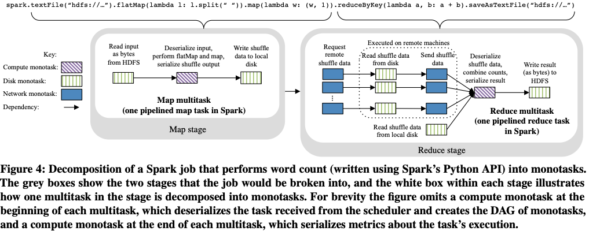
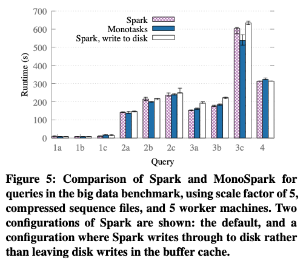
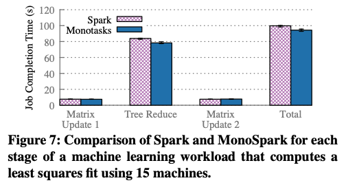
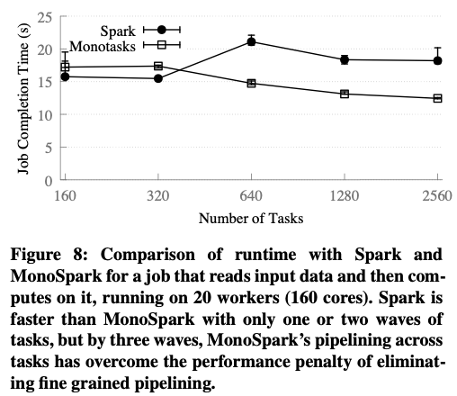
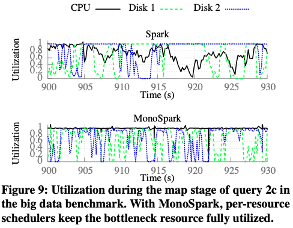
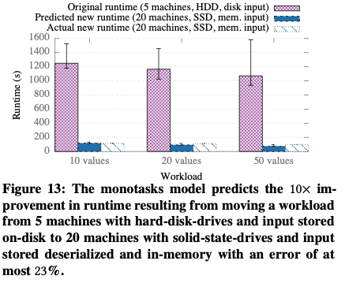

# Monotasks: Architecting for Performance Clarity in Data Analytics Frameworks

## One-line Summary

Instead of breaking data analytics jobs into tasks that pipeline many resources, we break the jobs into monotasks, each of which uses a single resource. This makes the analysis on performance bottlenecks in data analytics frameworks easier for users while retaining performance.

## Paper Structure Outline

1. INTRODUCTION
2. BACKGROUND
   1. Architecture of data analytics frameworks
   2. The challenge of reasoning about performance
3. MONOTASKS ARCHITECTURE
   1. Design
   2. How are multitasks decomposed into monotasks?
   3. Scheduling monotasks on each worker
   4. How many multitasks should be assigned concurrently to each machine?
   5. How is memory access regulated?
4. IMPLEMENTATION
5. MONOTASKS PERFORMANCE
   1. Experimental setup
   2. Does getting rid of fine-grained pipelining hurt performance?
   3. When is MonoSpark slower than Spark?
   4. When is MonoSpark faster than Spark?
6. REASONING ABOUT PERFORMANCE
   1. Modeling performance
   2. Predicting runtime on different hardware
   3. Predicting runtime with deserialized data
   4. Predicting with both hardware and software changes
   5. Understanding bottlenecks
   6. Can this model be used for Spark?
7. LEVERAGING CLARITY: AUTO-CONFIGURATION
8. LIMITATIONS AND OPPORTUNITIES
9. RELATED WORK
10. CONCLUSION

## Background & Motivation

In current data analytics frameworks, it is very difficult for users to reason about the performance of their workloads, thus increasing the difficulty for optimizations. The challenges of reasoning about performance include:

1. Tasks have non-uniform resource use
2. Concurrent tasks on a machine may contend
3. Resource use occurs outside the control of the analytics framework \(controlled by OS\)

## Design and Implementation

Traditional fine-grained pipelining used in today's tasks \(multitasks\) are replaced with statistical multiplexing across monotasks that each use a single resource. The decomposing of multitasks into monotasks can be done internally by the framework w/o changing the existing API. To resolve the aforementioned issues, Monotasks has these design principles in mind:

1. Each monotasks uses one resource
2. Monotasks execute in isolation
3. Per-resource schedulers control contention
4. Per-resource schedulers have complete control over each resource

In this paper, the authors presented MonoSpark, which is essentially Apache Spark with the above design choices integrated.

On each worker, monotasks are scheduled using two layers of schedulers.

* **Top-level scheduler \(local DAG scheduler\)**: Manages the DAG of monotasks for each multitask. Tracks dependencies for monotasks and submit the monotask to the resource that it's waiting for when the dependencies are complete.
* **Low-level scheduler \(dedicated, per-resource \(CPU, disk, network\) scheduler\)**: Written at the application level and not within the OS, meaning that the resource use is not perfectly controlled.

When more monotasks are waiting for a resource that can run concurrently, monotasks will be queued. The queues implement round-robin over monotasks in different phases of the multitask DAG.

A MonoSpark job scheduler works like the Spark job scheduler but it assigns more concurrent multitasks to each machine to improve resource utilization.

MonoSpark is compatible with Spark's public API in that if someone has an application on top of Spark, switching to MonoSpark requires only a modification in the build file.

## Evaluation

Three benchmark workloads are used: Sort, Big Data Benchmark, and Machine Learning.

### When is MonoSpark slower than Spark?

1. **When a workload is not broken into sufficiently many multitasks**: MonoSpark's coarser-grained pipelining will sacrifice performance when the pipelining is too coarse
2. **Disk writes**: In disk monotasks, all writes are flushed to disk to ensure that future disk monotasks get dedicated use of the disk, while Spark writes data to buffer cache and does not force data to disk.

### Why is MonoSpark faster than Spark in some cases?

1. Per-resource schedulers control contention, which results in higher disk bandwidth for workloads that run on hard disk drives, due to avoiding unnecessary seeks.
2. Per-resource schedulers allow monotasks to fully utilize the bottleneck resource without unnecessary contention.

### Reasoning about performance

## Links

* [Paper PDF](http://kayousterhout.org/publications/sosp17-final183.pdf)
* [Presentation slides @ SOSP '17](http://kayousterhout.org/talks/2017_10_29_SOSP_Monotasks.pdf)
* [Slides for CS34702 @ U Chicago](https://people.cs.uchicago.edu/~junchenj/34702/slides/34702-MonoTasks.pdf)
* [spark-monotasks on GitHub](https://github.com/NetSys/spark-monotasks)

