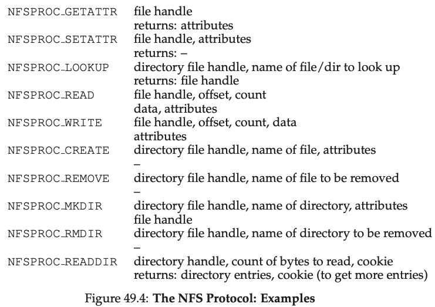
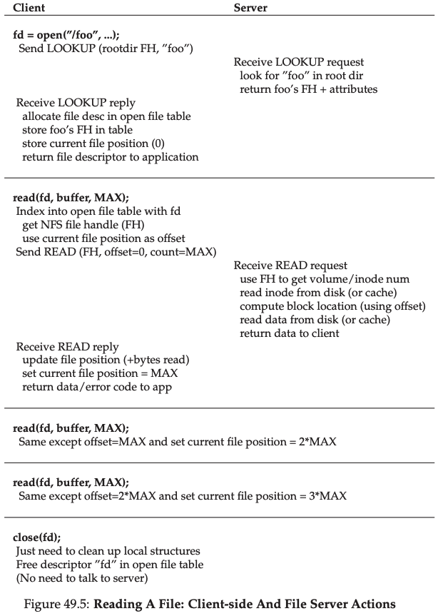
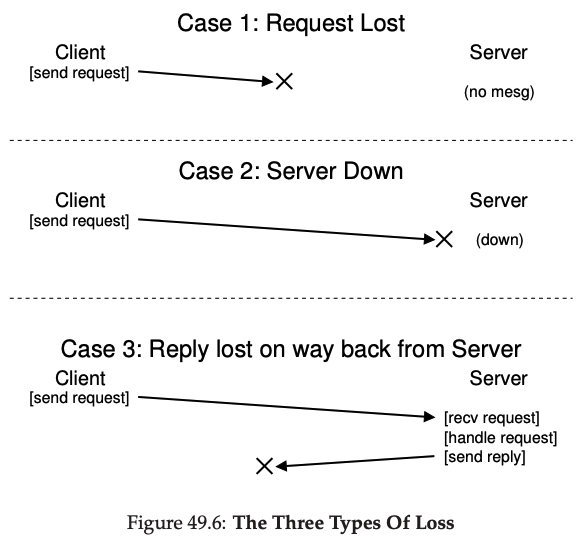
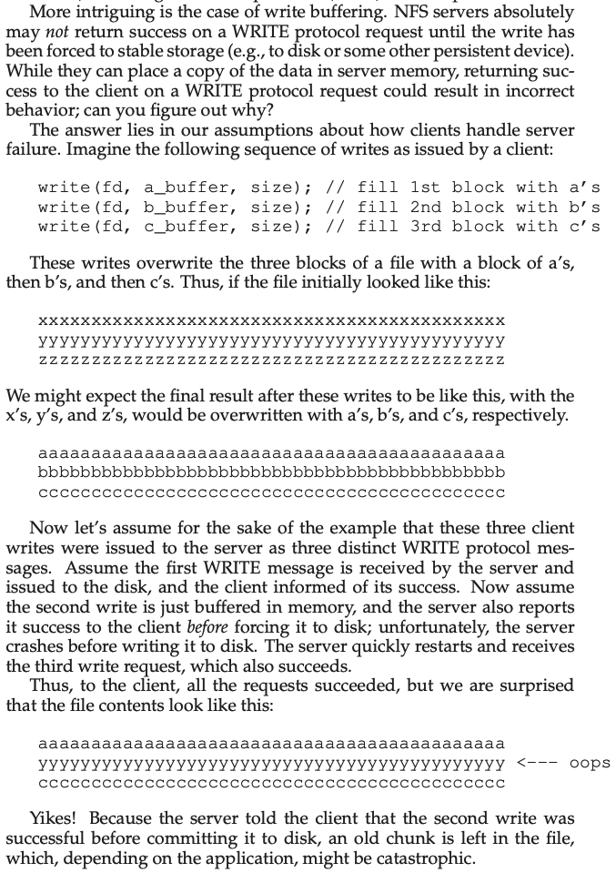

# NFS: Sun's Network File System

## One-line Summary

NFS is a distributed file system with transparent access to files from clients.

## Chapter Structure Outline

1. A Basic Distributed File System
2. On To NFS
3. Focus: Simple And Fast Server Crash Recovery
4. Key To Fast Crash Recovery: **Stateless**ness
5. The NFSv2 Protocol
6. From Protocol to Distributed File System
7. Handling Server Failure With **Idempotent** Operations
8. Improving Performance: Client-side Caching
9. The **Cache** Consistency Problem
10. Assessing NFS Cache Consistency
11. Implications On Server-Side Write Buffering
12. Summary

## Background & Motivation

A distributed file system has the following advantages:

* Allows for the **easy sharing** of data across clients
* **Centralized administration** \(e.g., backing up files can be done from the few server machines instead of from the multitude of clients\)
* **Security**: Having all servers in a locked machine room prevents certain types of problems from arising

## A Basic Distributed File System

A simple client/server distributed file system has two file systems on the client-side and server-side, respectively. For a client application, it issues the same syscalls as it would have done on a non-distributed system, and the underlying architecture handles the rest: Client-side FS sends a message to server-side FS, file server reads the block from disk/in-mem cache, file server sends a message back to client-side FS, client-side FS copies the data into the user buffer. Note that ideally, for a subsequent read\(\) of the same block, the block will already have been cached in memory/disk and thus no network traffic will be generated. 

## NFSv2: Stateless Protocol for Simple, Fast Server Crash Recovery

Stateful protocols complicate crash \(both server-side and client-side\) recovery. As a result, NFS pursues a stateless approach: each client operation contains all the information needed to complete the request. In short, **servers don't remember clients**.

### File handle

In stateful protocols, the servers maintain a file-descriptor-to-actual-file relationship, which is unknown after recovery. In stateless protocols, a **file handle** \(FH\) can be considered as having three components: a volume identifier \(which NFS volume the inode \# is in\), an inode number, and a generation number \(used to track inode reuse\). Together, they comprise a unique identifier for a file/directory. Every client's RPC call needs to pass a file handle, and the server returns the file handle whenever is needed \(e.g., mkdir\).

### Idempotent operations

When a client communicates with the server and doesn't hear back, it doesn't know if the server crashed before or after doing the operation. NFS's solution is to make its API idempotent so that a client can simply retry the request as there's no harm in executing functions more than once. `LOOKUP` and `READ` requests are trivially idempotent, and `WRITE` are also idempotent as a `WRITE` message contains the exact offset to write the data to, thus multiple writes is the same as a single write. `APPEND`, `MKDIR`, and `CREAT` are more complicated, though.

### Caching / Write buffering

The clients do client-side caching to reduce network traffic and improve performance. The clients also do write buffering using the caches as temporary buffers to allow asynchronous writes \(decouple application `write()` latency from actual write performance\). Every coin has two sides, though...

#### The cache consistency problem

There are two subproblems: **update visibility** \(write buffering makes server data not up-to-date\) and **stale cache** \(update to server data is not propagated to previously-cached old versions of the data\).

For update visibility, clients implement **flush-on-close/close-to-open** consistency semantics. When a file is written to and closed by a client application, all updates are flushed to the server so that the next server access sees the latest data. For stale cache, before using a cached block, the client issues a `GETATTR` to check if the cache is holding the latest data. If so, the clients uses the cached data; otherwise, the client invalidates the file. As a result, the servers get flooded with `GETATTR` requests. The solution is to give each client an attribute cache. The attributes in the attribute cache time out after a certain amount of time \(e.g., 3s\). Before the timeout, all file accesses would look at the cache instead of going over the network for validation.

#### Server-side write buffering

Servers buffer the writes in memory and write to disks asynchronously. A problem with this is that writes in memory can get lost in case of a crash. The solution is to commit each write tostable/persistent storage before informing the client of success. This allows clients to detect server failures during a write, and thus retry until it finally succeeds. As a result, the write performance can become the performance bottleneck. Some solutions include:

* \(By companies like NetApp\) First put writes in a battery-backed memory, thus enabling to quickly reply to `WRITE` requests without fear of losing the data and without the cost of having to write to disk right away
* Use a FS specifically designed to write to disk quickly when one finally needs to do so

## Conclusion

## New Vocabulary

* Idempotent: If `f()` is idempotent, then `f()` has the same effect as `f(); f(); ...; f();`

## Links

* [The Sun Network Filesystem: Design, Implementation and Experience](https://www.cs.ucf.edu/~eurip/papers/sandbergnfs.pdf)
* [OSTEP chapter on NFS](http://pages.cs.wisc.edu/~remzi/OSTEP/dist-nfs.pdf)
* Prof. Shivaram's course notes on NFS from CS 537 @ UW-Madison \([part 1](http://pages.cs.wisc.edu/~shivaram/cs537-sp20-notes/dist-nfs/cs537-dist-nfs-notes.pdf)\) \([part 2](http://pages.cs.wisc.edu/~shivaram/cs537-sp20-notes/nfs-wrap/cs537-nfs-wrap-notes.pdf)\)
* [Zeyuan Hu's paper reading notes](https://zhu45.org/posts/2018/May/01/suns-network-file-system-nfs/)

