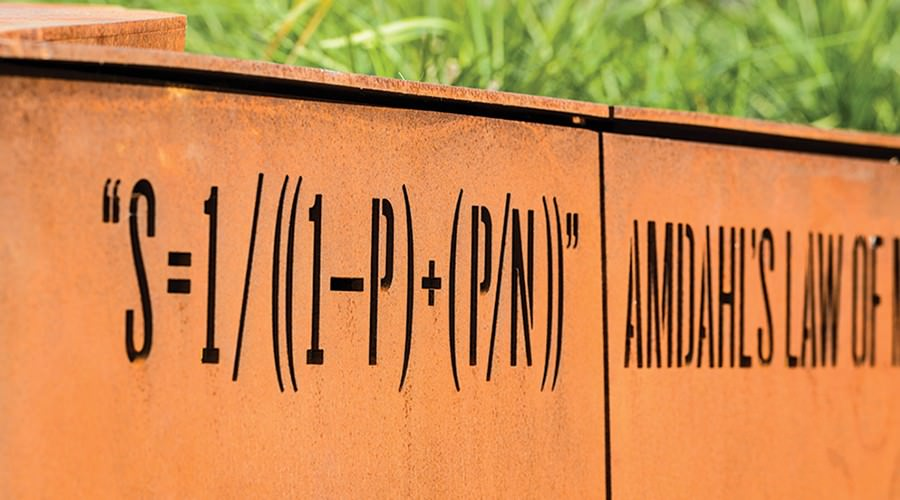
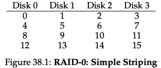
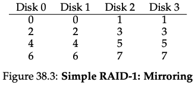
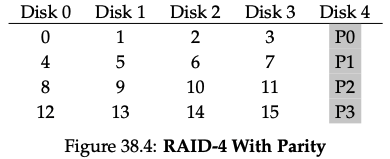
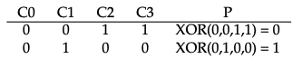
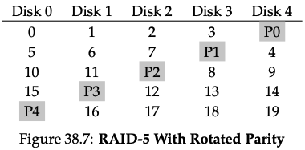
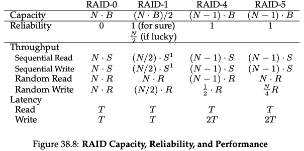

# RAID: A Case for Redundant Arrays of Inexpensive Disks

## One-line Summary

Redundant arrays of inexpensive disks are used to address the I/O crisis. A tradeoff analysis is presented.

## Paper Structure Outline

1. Background: Rising CPU and Memory Performance
2. The Pending I/O Crisis
3. A Solution: Arrays of Inexpensive Disks
4. Caveats
5. And Now The Bad News: Reality
6. A Better Solution: RAID
7. First Level RAID: Mirrored Disks
8. Second Level RAID: Hamming Code for ECC
9. Third Level RAID: Single Check Disk Per Group
10. Fourth Level RAID: Independent Reads/Writes
11. Fifth Level RAID: No Single Check Disk
12. Discussion
13. Conclusion

## Background & Motivation

The performance in I/O is not catching up with that in CPU and memory. Gene Amdahl \(an American computer architect who completed his Ph.D. at UW-Madison!\) presented Amdahl's Law, which stated that the overall speedup relies on the worst-performing sections the most:

$$
S = {1 \over (1 - f) + f / k}
$$


* S = the effective speedup
* f = fraction of work in fast mode
* k = speedup while in fast mode


The implication of this rule is as follows: Suppose that 10% of some application is spent in I/O. If we have computers 100 times faster \(through the evolution of uniprocessors or by multiprocessors\), the overall speedup will be less than 10 times faster, wasting ~90% of the potential speedup. This is the I/O crisis people were facing.

Inexpensive disks have lower I/O \(but not that low\), and in some aspects, they are superior or equal to the larger disks. This inspired people to use an array of inexpensive disks. However, there is very little fault-tolerance: The Mean Time To Failure \(MTTF\) of an array of disks is:

$$
MTTF of a Disk Array = {MTTF of a Single Disk \over Number of Disks in the Array}
$$

Therefore, people made use of extra disks containing redundant information for recovery.

## Design and Implementation

### RAID-0: Striping, no redundancy

RAID-0 is actually not RAID, as there is no redundancy. However, by striping the data, RAID-0 achieves the upper-bound on performance and capacity.

### RAID-1: Mirroring

RAID-1 is sometimes called RAID-10 \(1+0, stripe of mirrors\). RAID-1 is capacity-expensive \(only 50% with mirroring level = 2\) but very good against failures \(can tolerate up to half of the disk failing if we are lucky\).

### RAID-4: Parity

The parity disk uses XOR to calculate the parity of the data disks and can tolerate the loss of any one block from our stripe. A drawback is the small-write problem: see the evaluation section below for more detail.

### RAID-5: Rotating parity

An attempt to increase the performance of random writes. Now the parity block is rotated across drives instead of on one single disk.

## Evaluation

There are two types of workloads:

* Sequential: Requests to the array come in large contiguous chunks. E.g., a request that accesses 1 MB of data that starts at block x and ending at block \(x+1 MB\). Sequential workloads are very common.
* Random: Each request is to a different random location on the disk. DBMS-related workloads often exhibit this pattern.


* N: Number of disks
* B: Number of blocks per disk
* S: I/O for one disk under a sequential workload
* R: I/O for one disk under a random workload
* T: The time that a request to a single disk would take


Some interesting data points:

* Sequential read for RAID-1: Unlike random read where we can distribute the reads to all the disks and thus obtain full possible bandwidth, in sequential reads, the bandwidth utilization is only 50%. Consider disk 0 in figure 38.3. When a sequential read is issued \(0, 1, 2, 3, 4, ...\), disk 0 gets a request for block 0 and then block 4, skipping block 2. While it is rotating over the skipped block, it is not delivering useful bandwidth to the client.
* Sequential write for RAID-4: A simple optimization, full-stripe write, is used. We first calculate the value of the new parity and then write all of the blocks to all disks above in parallel.
* Random write for RAID-4: Both the data disk and the parity disk needs to be written. There are two methods: the additive/subtractive parity method. In subtractive, for each write, RAID has to perform 4 I/Os \(2 reads & 2 writes\). When a series of writes comes in, the parity becomes a bottleneck in that all requests have to read the related parity blocks. This is known as **the small-write problem**.
* Random read for RAID-5: Slightly better than that for RAID-4 as now we can utilize all disks.
* Random write for RAID-5: Parallelism across requests. We can assume that given a large number of random requests, we can keep all the disks about evenly busy.

## Links

* [Paper PDF](http://web.mit.edu/6.033/2015/wwwdocs/papers/Patterson88.pdf)
* [RAID in OSTEP](http://pages.cs.wisc.edu/~remzi/OSTEP/file-raid.pdf)
* [RAID in CS 537 @ UW-Madison](http://pages.cs.wisc.edu/~shivaram/cs537-sp20-notes/raid/cs537-raid-notes.pdf)

