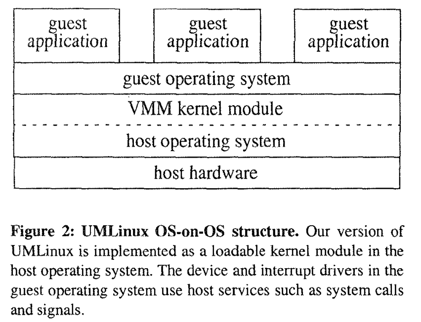
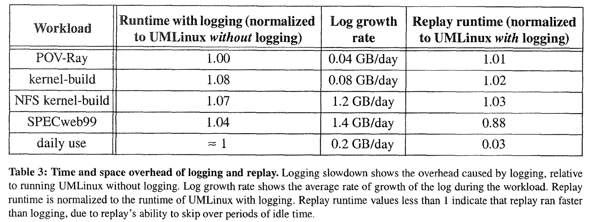

# ReVirt: Enabling Intrusion Analysis through Virtual-Machine Logging and Replay

## One-line Summary

ReVirt utilizes techniques in virtual machines and fault-tolerance to allow a system to replay a long-term, instruction-by-instruction execution log. It does so by moving the target OS and applications into a VM and logging below it.

## Paper Structure Outline

1. Introduction
2. Virtual Machines
3. UMLinux
   1. UMLinux Structure and Operation
   2. Trusted Computing Base for UMLinux
4. Logging and Replaying UMLinux
   1. Overview
   2. ReVirt
   3. Cooperative Logging
   4. Alternative Architectures for Logging and Replay
   5. Using ReVirt to Analyze Attacks
5. Experiments
   1. Virtualization Overhead
   2. Validating ReVirt Correctness
   3. Logging and Replaying Overhead
   4. Analyzing an Attack
6. Related Work
7. Future Work
8. Conclusions

## Background & Motivation

A typical system relies on event loggers \(login attempts, TCP connection requests, file system mount requests, etc.\) for post-attack analysis. Current system loggers have two problems: 

1. They lack integrity because they assume the operating system kernel is trustworthy, while the kernel is vulnerable to many forms of attacks. Attackers who compromise OS can delete log records or prevent writing of new records.
2.  Also, they lack completeness as they do not log enough information to recreate some attacks in hindsight. Only a few system events are saved, so we must guess what happened.

ReVirt removes the dependency on the OS by encapsulating the OS and applications into a virtual machine and logging below the virtual machine. This separates the logger from potential vulnerabilities. ReVirt also logs enough information to replay a long-term execution of the virtual machine instruction-by-instruction. It does so by adapting techniques used in fault-tolerance for primary-backup recovery \(checkpointing, logging, roll-forward recovery, etc.\).

## Design and Implementation

ReVirt is implemented as a set of modifications to the host kernel. It logs both asynchronous virtual interrupts and all input from external entities \(keyboard, CD-ROM, etc.\).

## Evaluation

In this section, the authors validate the correctness and quantify the virtualization and logging overheads. All experiments are done by running five workloads.

The correctness of ReVirt was confirmed by having ReVirt replay logging runs of benchmarks and comparing the result with the original run.

## New Vocabulary

* Hypervisor: It's a virtual machine monitor that creates and runs VMs.

## Links

* [Paper PDF](https://web.eecs.umich.edu/virtual/papers/dunlap02.pdf)

