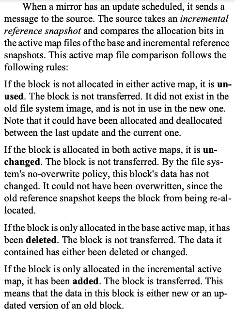
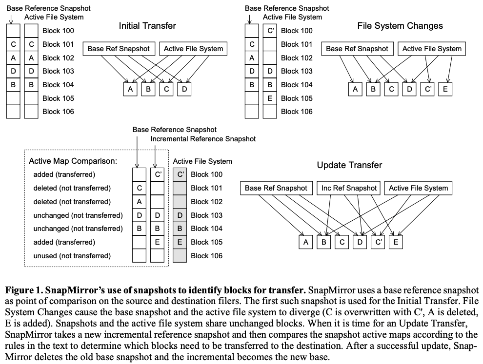
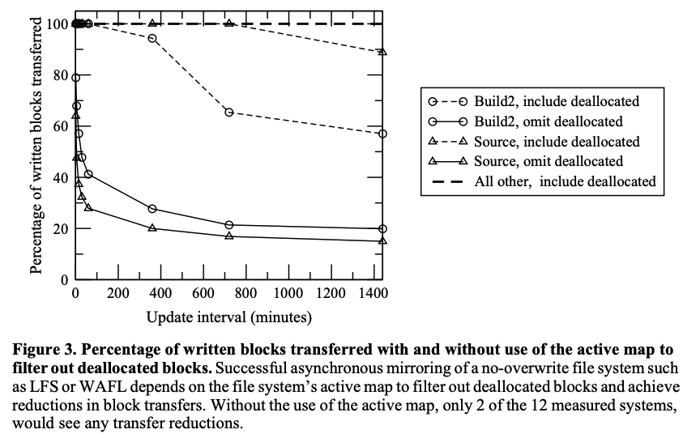
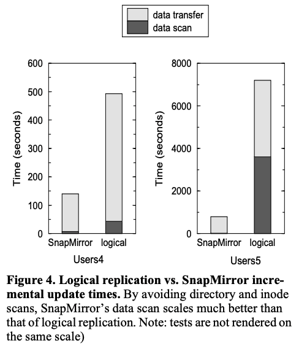
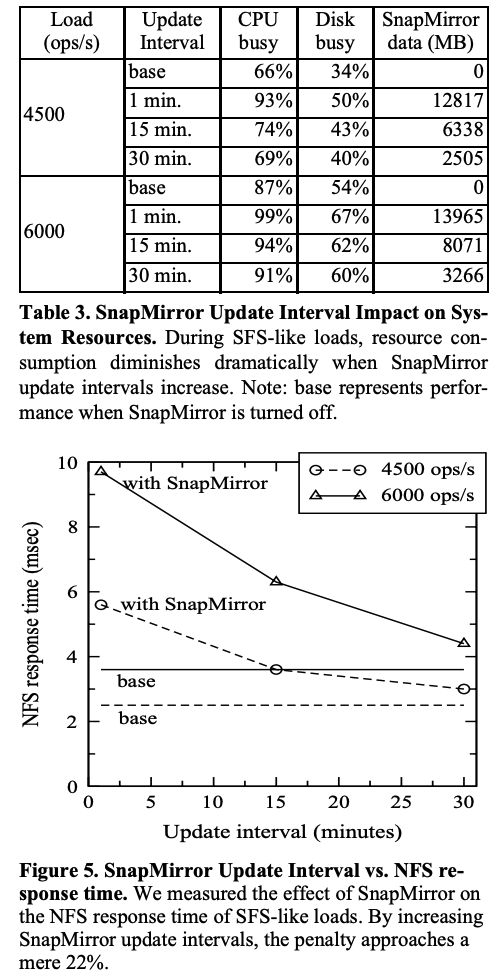

# SnapMirror: File-System-Based Asynchronous Mirroring for Disaster Recovery

## One-line Summary

SnapMirror is an asynchronous mirroring technology that leverages file system snapshots to ensure the consistency of the remote mirror and optimize data transfer.

## Paper Structure Outline

1. Introduction
   1. Outline for Remainder of Paper
   2. Requirements for Disaster Recovery
   3. Recovering from Off-line Data
   4. Remote Mirroring
2. Related Work
3. SnapMirror Design and Implementation
   1. Snapshots and the Active Map File
   2. SnapMirror Implementation
      1. Initializing the Mirror
      2. Block-Level Differences and Update Transfers
      3. Disaster Recovery and Aborted Transfers
      4. Update Scheduling and Transfer Rate Throttling
   3. SnapMirror Advantages and Limitations
4. Data Reduction through Asynchrony
   1. Tracing environment
   2. Results
5. SnapMirror vs. Asynchronous Logical Mirroring
   1. Experimental Setup
   2. Results
6. SnapMirror on a loaded system
   1. Results
7. Conclusion

## Background & Motivation

There are currently two main mechanisms for data recovery \(in case of data unavailability like a fire in the datacenter\):

* Rely on affordable tape but risk the loss of a full day of data and face many hours or even days to recover \(**inadequate protection**\)
* Have the benefits of a fully synchronized on-line remote mirror, but pay steep costs in both write latency and network bandwidth to maintain the mirror \(**too expensive in performance and/or network bandwidth**\)

SnapMirror allows a mirror volume to lag behind the primary volume to substantially reduce the costs of maintaining a mirror while bounding the amount of data loss. The amount of the lag is a tunable parameter that allows data managers to achieve the right balance between potential data loss and cost.

There are a few challenges in maintaining an async mirror:

1. The system must determine which blocks need to be transferred to the mirror to minimize data transfer
2. The destination must have \(or is able to be recovered to\) a self-consistent state
3. For performance, disk reads on the source and writes on the destination must be efficient

SnapMirror leverages the internal data structures of NetApp's WAFL file system to solve these issues.

## Design and Implementation

### Snapshots

Similar to LFS, WAFL enforces a no-overwrite policy. However, WAFL doesn't do garbage collection. Instead, it keeps track of individual blocks and writes to the free ones. WAFL's on-disk structure is a tree that points to all data and metadata. The root of the tree is called the fsinfo block. A complete and consistent version of the file system can be reached from the information in this block. It's also the only exception to the no-overwrite policy.

To preserve a consistent image of a file system, a snapshot, we simply save a copy of the information in the fsinfo block and then make sure that the blocks that comprise the file system image are not reallocated. The block allocations for each snapshot is maintained in its own active map file, a bitmap that checks if blocks are alive or not, by WAFL. By doing a bitwise OR over all of the snapshot's active file map, we can check if a block is still needed and thus cannot be reallocated.

### Mirrors

A mirror is a block-by-block, read-only, online replica of the file system. Copies are made to the same logical block on the destination as the source. The fsinfo block is updated at the end.

## Evaluation

## New Vocabulary

* WAFL: Write Anywhere File Layout file system.

## Links

* [Paper PDF](https://www.usenix.org/legacy/publications/library/proceedings/fast02/full_papers/patterson/patterson.pdf)
* [Asynchronous SnapMirror disaster recovery basic by NetApp](https://docs.netapp.com/ontap-9/index.jsp?topic=%2Fcom.netapp.doc.pow-dap%2FGUID-18263F03-486B-434C-A190-C05D3AFC05DD.html)
* Thanks to Brian Chang for the paper review notes!



