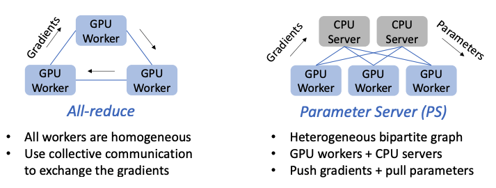
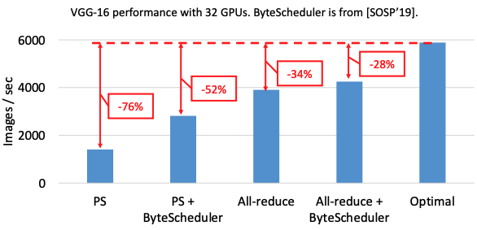
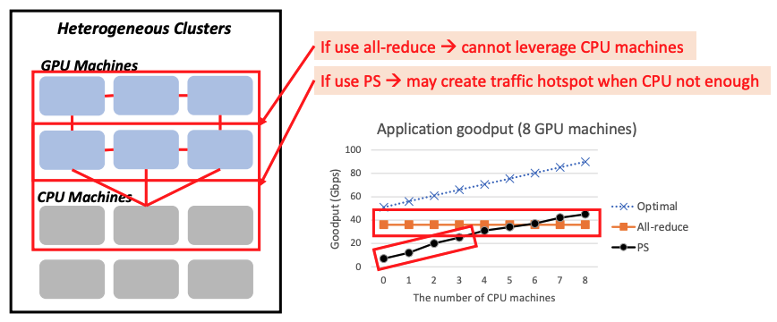
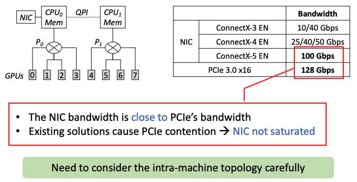

# BytePS: A high performance and generic framework for distributed DNN training

### One-liner Summary

### Table of Contents

1. Introduction
2. Background
   1. Distributed DNN Training
   2. All-reduce
   3. Parameter Server \(PS\)
3. Motivation and BytePS Architecture
   1. Motivation
   2. Architecture Overview
4. BytePS Communication Design
   1. Inter-machine Communication
      1. Communication Efficiency Analysis
   2. Intra-machine Communication
      1. PCIe-only Topology
      2. NVLink-based Topology
      3. Discussion
5. Summation Service
6. Implementation
   1. Multi-Stage Pipeline
   2. Address RDMA Performance Issues
   3. BytePS Usage
7. Evaluation
   1. Inter-machine Microbenchmarks
   2. Leverage CPU Machines
   3. Adapt to Intra-machine Topology
   4. Scalability
8. Observations and Discussion
9. Related Work
10. Conclusion

### Background & Motivation

Existing architectures \(all\_reduce and parameter server\) for distributed DNN training are insufficient.

The paper analyzed three problems that lead to this slowdown, and then presented a solution to each problem:

1. Sub-optimal Inter-machine Communication
2. Sub-optimal Intra-machine Communication
3. The CPU Bottleneck

#### Sub-optimal Inter-machine Communication

For allreduce, the CPUs are not leveraged properly as the communication is between GPUs only. For PS, if there are insufficient CPUs for servers, bottlenecks may be created. **The solution is an optimal communication strategy that unifies allreduce and PS.**

#### Sub-optimal Intra-machine Communication

There are often multiple GPUs in a GPU machine IRL. The internal topology is also a network, which results in bottlenecks. **The solution is intra-machine optimizations that accommodate diverse intra-machine topologies.**

#### The CPU Bottleneck

In the parameter server setup, the GPU workers send the gradients to CPU servers. The CPU servers first aggregate the gradients received, and then update the parameters using the optimizer function. The problem is that CPUs might not match network rates, thus creating bottlenecks. **The solution is a summation service that moves parameter updates to GPUs.**

### Design and Implementation

### Evaluation

### New Vocabulary

* Network Interface Controller \(NIC\)
* PCI Express \(PCIe\)

### Links

* [Paper PDF](https://www.usenix.org/system/files/osdi20-jiang.pdf)
* [Presentation Video at OSDI '20](https://www.youtube.com/watch?v=j8PHNglSZX8&feature=emb_logo&ab_channel=USENIX)
* [Presentation Slides PDF](https://www.usenix.org/sites/default/files/conference/protected-files/osdi20_slides_jiang.pdf)
* [Byteps on GitHub](https://github.com/bytedance/byteps)

